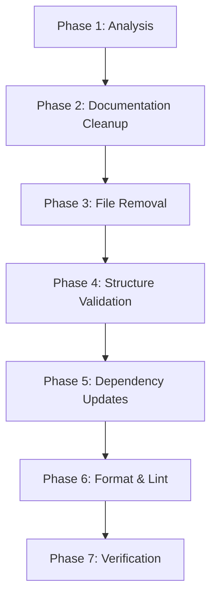

# Design Document: Codebase Cleanup

## Overview

This design document outlines the approach for cleaning up and organizing the Dx codebase. The cleanup involves consolidating documentation, removing unnecessary files, validating folder structure, updating dependencies, and ensuring formatting/linting compliance.

## Architecture

The cleanup process follows a phased approach:



### Phase Descriptions

1. **Analysis Phase**: Identify all files requiring action
2. **Documentation Cleanup**: Consolidate and organize /docs
3. **File Removal**: Remove empty, duplicate, and temporary files
4. **Structure Validation**: Ensure proper folder organization
5. **Dependency Updates**: Update Cargo.toml dependencies
6. **Format & Lint**: Run rustfmt and clippy
7. **Verification**: Validate all changes

## Components and Interfaces

### Documentation Organization Structure

The /docs folder will be reorganized into the following structure:

```
docs/
├── README.md                    # Main documentation index
├── architecture/                # System architecture docs
│   ├── ARCHITECTURE.md
│   ├── COMPILER_INTELLIGENCE.md
│   └── PROJECT_STRUCTURE.md
├── crates/                      # Per-crate documentation
│   ├── dx-serializer.md
│   ├── dx-js-runtime.md
│   └── ...
├── guides/                      # User guides
│   ├── QUICKSTART.md
│   ├── CONTRIBUTING.md
│   └── DEVELOPMENT.md
├── reference/                   # Technical reference
│   ├── CODE_STANDARD.md
│   ├── CODING_STANDARD.md
│   └── API.md
├── protocols/                   # Protocol specifications
│   ├── DXL_LOCK_SPEC.md
│   ├── DXP_FORMAT_SPEC.md
│   └── DXRP_PROTOCOL_SPEC.md
├── benchmarks/                  # Benchmark results (NEW)
│   ├── DX_SERIALIZER_BENCHMARK.md
│   ├── DX_JS_RUNTIME_BENCHMARK.md
│   └── ...
├── progress/                    # Development progress logs
│   └── ... (archived progress files)
└── archive/                     # Historical/deprecated docs (NEW)
    ├── victory-reports/         # Consolidated victory files
    ├── session-summaries/       # Session summary files
    └── deprecated/              # Old/superseded docs
```

### Files to Move from Root

| File | Destination |
|------|-------------|
| DX.md | docs/README.md (merge) or docs/DX.md |
| DX_FORGE.md | docs/crates/dx-forge.md |
| Thought.md | docs/archive/THOUGHTS.md |

### Files to Remove

| File | Reason |
|------|--------|
| docs/THOUHTS.md | Typo duplicate of THOUGHTS.md |
| docs/implementation_plan.md.resolved | Temporary artifact |
| docs/task.md.resolved | Temporary artifact |
| docs/PACKAGE_MANAGER_QUICK_REF.md.old | Old backup file |
| docs/*.txt (benchmark outputs) | Should be in benchmarks/ or removed |

### Files to Consolidate

| Category | Files to Merge | Target |
|----------|---------------|--------|
| Victory Reports | VICTORY_*.md, *_VICTORY.md, COMPLETE_*.md | docs/archive/victory-reports/ |
| Session Summaries | SESSION_*.md, SUMMARY_*.md | docs/archive/session-summaries/ |
| Quick References | *_QUICK_REF.md | docs/reference/quick-refs/ |
| Benchmark Results | *_BENCHMARK*.md | docs/benchmarks/ |

## Data Models

### File Classification Model

```rust
enum FileAction {
    Keep,           // File stays in place
    Move(PathBuf),  // File moves to new location
    Remove,         // File should be deleted
    Merge(PathBuf), // File content merges into target
}

struct FileAnalysis {
    path: PathBuf,
    action: FileAction,
    reason: String,
}
```

### Dependency Update Model

```rust
struct DependencyUpdate {
    name: String,
    current_version: String,
    latest_version: String,
    breaking_changes: bool,
}
```

## Correctness Properties

*A property is a characteristic or behavior that should hold true across all valid executions of a system-essentially, a formal statement about what the system should do. Properties serve as the bridge between human-readable specifications and machine-verifiable correctness guarantees.*

### Property 1: No Broken References After File Moves
*For any* documentation file that is moved, all internal references (links) to that file in other documents should be updated to point to the new location.
**Validates: Requirements 1.5**

### Property 2: Empty File Detection
*For any* file in the repository, if the file contains no content or only whitespace characters, it should be flagged for removal.
**Validates: Requirements 2.1**

### Property 3: No Empty Directories After Cleanup
*For any* directory in the repository after cleanup, the directory should contain at least one file or be removed.
**Validates: Requirements 2.3**

### Property 4: No Orphaned Dependencies
*For any* file that is removed, no other file in the repository should reference or depend on it.
**Validates: Requirements 2.4**

### Property 5: Workspace Member Location
*For any* crate that is a workspace member, the crate should be located in the /crates directory.
**Validates: Requirements 3.1**

### Property 6: Root Directory Contents
*For any* file in the root directory, the file should be one of: Cargo.toml, Cargo.lock, README.md, rustfmt.toml, .clippy.toml, .gitignore, or a necessary configuration file.
**Validates: Requirements 6.3**

### Property 7: Crate Documentation Presence
*For any* crate in the workspace, the crate should have either a README.md file or documentation in lib.rs.
**Validates: Requirements 7.1**

### Property 8: Reference Integrity After Moves
*For any* documentation file that references another file, the referenced file should exist at the specified path.
**Validates: Requirements 7.3**

## Error Handling

### File Operation Errors
- If a file cannot be moved due to permissions, log error and continue
- If a file cannot be deleted, log error and continue
- If a directory cannot be created, fail the operation

### Dependency Update Errors
- If cargo update fails, document the error and continue with other updates
- If a breaking change is detected, document required code changes

### Format/Lint Errors
- If rustfmt fails, document the files that need manual attention
- If clippy reports errors, document them for manual review

## Testing Strategy

### Dual Testing Approach

This cleanup operation will use both manual verification and automated checks:

#### Manual Verification
- Visual inspection of folder structure
- Review of consolidated documentation
- Verification of moved files

#### Automated Checks
- `cargo check` - Verify workspace compiles
- `cargo fmt --check` - Verify formatting
- `cargo clippy` - Verify no lint warnings
- Link checker - Verify no broken documentation links

### Property-Based Testing

For properties that can be automated, we will use shell scripts to verify:

1. **Empty Directory Check**: Script to find empty directories
2. **Root Directory Check**: Script to verify only allowed files in root
3. **Crate Documentation Check**: Script to verify each crate has docs
4. **Broken Link Check**: Script to find broken markdown links

### Test Commands

```bash
# Verify no empty directories
find . -type d -empty -not -path "./.git/*" -not -path "./target/*"

# Verify root directory contents
ls -la | grep -v "^d" | grep -v "Cargo" | grep -v "README" | grep -v "rustfmt" | grep -v "clippy" | grep -v "gitignore"

# Verify formatting
cargo fmt --all --check

# Verify linting
cargo clippy --workspace --all-targets -- -D warnings

# Verify compilation
cargo check --workspace
```
