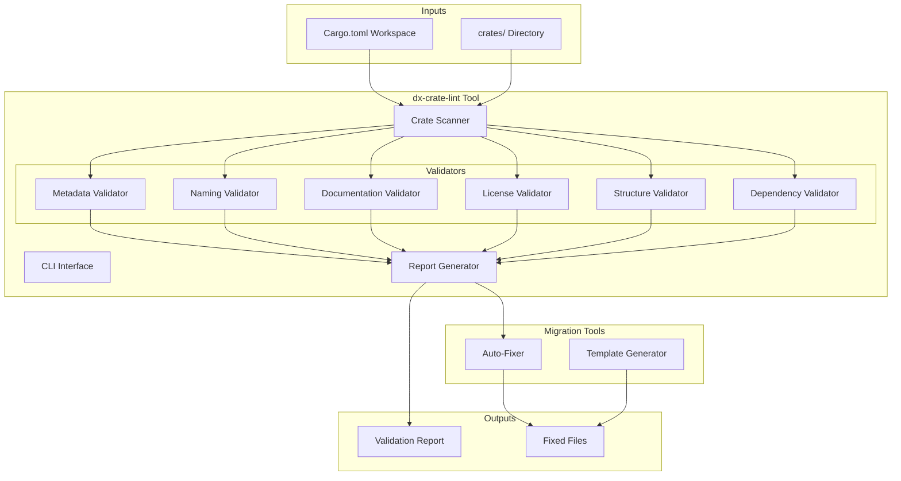

# Design Document: Crates Professionalization

## Overview

This design document outlines the architecture and implementation approach for professionalizing the DX ecosystem's crates folder. The solution consists of a validation tool (`dx-crate-lint`) that can be run as part of CI/CD to enforce standards, plus a set of templates and scripts to bring existing crates into compliance.

The approach is non-destructive: the tool validates and reports issues, while separate migration scripts apply fixes with user confirmation.

## Architecture



## Components and Interfaces

### 1. Crate Scanner

Discovers and parses all crates in the workspace.

```rust
pub struct CrateScanner {
    workspace_root: PathBuf,
    workspace_config: WorkspaceConfig,
}

pub struct CrateInfo {
    pub name: String,
    pub path: PathBuf,
    pub cargo_toml: CargoToml,
    pub crate_type: CrateType,
    pub files: Vec<PathBuf>,
}

pub enum CrateType {
    TopLevelTool,      // crates/dx, crates/cli, crates/forge
    Library,           // crates/serializer, crates/generator
    WwwModule,         // crates/www/*
    JavaScriptModule,  // crates/javascript/*
    Nested,            // Crates within other crates
}

impl CrateScanner {
    pub fn scan(&self) -> Result<Vec<CrateInfo>>;
    pub fn get_workspace_config(&self) -> &WorkspaceConfig;
}
```

### 2. Metadata Validator

Validates Cargo.toml metadata against workspace standards.

```rust
pub struct MetadataValidator {
    workspace_config: WorkspaceConfig,
    rules: MetadataRules,
}

pub struct MetadataRules {
    pub required_workspace_fields: Vec<&'static str>,
    pub required_fields: Vec<&'static str>,
    pub valid_categories: HashSet<String>,
    pub keyword_limits: (usize, usize), // min, max
}

pub struct MetadataViolation {
    pub crate_name: String,
    pub field: String,
    pub violation_type: ViolationType,
    pub message: String,
    pub fix: Option<String>,
}

impl MetadataValidator {
    pub fn validate(&self, crate_info: &CrateInfo) -> Vec<MetadataViolation>;
    pub fn validate_workspace_inheritance(&self, cargo: &CargoToml) -> Vec<MetadataViolation>;
    pub fn validate_required_fields(&self, cargo: &CargoToml) -> Vec<MetadataViolation>;
}
```

### 3. Naming Validator

Enforces naming conventions across the ecosystem.

```rust
pub struct NamingValidator {
    patterns: NamingPatterns,
}

pub struct NamingPatterns {
    pub tool_crate_pattern: Regex,      // dx-{name}
    pub www_crate_pattern: Regex,       // dx-www-{name}
    pub lib_name_pattern: Regex,        // dx_{name} (underscores)
    pub forbidden_generic_names: Vec<&'static str>,
}

pub struct NamingViolation {
    pub crate_name: String,
    pub current_name: String,
    pub expected_pattern: String,
    pub suggested_name: String,
}

impl NamingValidator {
    pub fn validate(&self, crate_info: &CrateInfo) -> Vec<NamingViolation>;
    pub fn suggest_name(&self, crate_info: &CrateInfo) -> String;
}
```

### 4. Documentation Validator

Ensures documentation files exist and meet quality standards.

```rust
pub struct DocumentationValidator {
    required_sections: Vec<ReadmeSection>,
    required_badges: Vec<BadgeType>,
}

pub enum ReadmeSection {
    Title,
    Badges,
    Overview,
    Features,
    Installation,
    Usage,
    License,
}

pub enum BadgeType {
    CratesIo,
    DocsRs,
    License,
}

pub struct DocumentationViolation {
    pub crate_name: String,
    pub file: String,
    pub violation_type: DocViolationType,
    pub message: String,
}

pub enum DocViolationType {
    MissingFile,
    MissingSection(ReadmeSection),
    MissingBadge(BadgeType),
    InvalidFormat,
}

impl DocumentationValidator {
    pub fn validate(&self, crate_info: &CrateInfo) -> Vec<DocumentationViolation>;
    pub fn validate_readme(&self, content: &str) -> Vec<DocumentationViolation>;
    pub fn validate_changelog(&self, content: &str) -> Vec<DocumentationViolation>;
}
```

### 5. License Validator

Ensures proper licensing across all crates.

```rust
pub struct LicenseValidator {
    expected_license: &'static str, // "MIT OR Apache-2.0"
    license_templates: LicenseTemplates,
}

pub struct LicenseTemplates {
    pub mit: String,
    pub apache: String,
    pub dual: String,
}

pub struct LicenseViolation {
    pub crate_name: String,
    pub violation_type: LicenseViolationType,
    pub message: String,
}

pub enum LicenseViolationType {
    MissingLicenseFile,
    MismatchedLicense,
    InvalidLicenseContent,
}

impl LicenseValidator {
    pub fn validate(&self, crate_info: &CrateInfo) -> Vec<LicenseViolation>;
}
```

### 6. Structure Validator

Validates directory structure conventions.

```rust
pub struct StructureValidator {
    required_structure: RequiredStructure,
}

pub struct RequiredStructure {
    pub required_dirs: Vec<&'static str>,  // ["src"]
    pub optional_dirs: Vec<&'static str>,  // ["tests", "benches", "examples"]
    pub required_files: Vec<&'static str>, // ["src/lib.rs" or "src/main.rs"]
}

pub struct StructureViolation {
    pub crate_name: String,
    pub violation_type: StructureViolationType,
    pub path: PathBuf,
    pub message: String,
}

impl StructureValidator {
    pub fn validate(&self, crate_info: &CrateInfo) -> Vec<StructureViolation>;
}
```

### 7. Dependency Validator

Ensures dependency consistency across the workspace.

```rust
pub struct DependencyValidator {
    workspace_deps: HashMap<String, DependencySpec>,
    internal_crates: HashSet<String>,
}

pub struct DependencyViolation {
    pub crate_name: String,
    pub dependency: String,
    pub violation_type: DepViolationType,
    pub message: String,
}

pub enum DepViolationType {
    NotUsingWorkspace,
    VersionMismatch,
    DuplicateVersion,
    InternalNotWorkspace,
}

impl DependencyValidator {
    pub fn validate(&self, crate_info: &CrateInfo) -> Vec<DependencyViolation>;
    pub fn find_duplicates(&self, crates: &[CrateInfo]) -> Vec<DependencyViolation>;
}
```

### 8. Report Generator

Generates human-readable and machine-readable reports.

```rust
pub struct ReportGenerator;

pub struct ValidationReport {
    pub summary: ReportSummary,
    pub violations: Vec<Violation>,
    pub by_crate: HashMap<String, Vec<Violation>>,
    pub by_category: HashMap<ViolationCategory, Vec<Violation>>,
}

pub struct ReportSummary {
    pub total_crates: usize,
    pub compliant_crates: usize,
    pub total_violations: usize,
    pub critical_violations: usize,
    pub auto_fixable: usize,
}

impl ReportGenerator {
    pub fn generate(&self, violations: Vec<Violation>) -> ValidationReport;
    pub fn to_json(&self, report: &ValidationReport) -> String;
    pub fn to_markdown(&self, report: &ValidationReport) -> String;
    pub fn to_terminal(&self, report: &ValidationReport) -> String;
}
```

## Data Models

### CargoToml Representation

```rust
#[derive(Debug, Clone, Serialize, Deserialize)]
pub struct CargoToml {
    pub package: Package,
    pub lib: Option<LibConfig>,
    pub bin: Vec<BinConfig>,
    pub dependencies: HashMap<String, Dependency>,
    pub dev_dependencies: HashMap<String, Dependency>,
    pub features: HashMap<String, Vec<String>>,
}

#[derive(Debug, Clone, Serialize, Deserialize)]
pub struct Package {
    pub name: String,
    pub version: VersionSpec,
    pub edition: EditionSpec,
    pub authors: AuthorsSpec,
    pub description: Option<String>,
    pub license: LicenseSpec,
    pub repository: RepositorySpec,
    pub documentation: Option<String>,
    pub homepage: Option<String>,
    pub keywords: Option<Vec<String>>,
    pub categories: Option<Vec<String>>,
    pub rust_version: Option<String>,
    pub include: Option<Vec<String>>,
}

#[derive(Debug, Clone, Serialize, Deserialize)]
#[serde(untagged)]
pub enum VersionSpec {
    Literal(String),
    Workspace { workspace: bool },
}

#[derive(Debug, Clone, Serialize, Deserialize)]
#[serde(untagged)]
pub enum Dependency {
    Simple(String),
    Detailed(DetailedDependency),
}

#[derive(Debug, Clone, Serialize, Deserialize)]
pub struct DetailedDependency {
    pub version: Option<String>,
    pub path: Option<String>,
    pub workspace: Option<bool>,
    pub features: Option<Vec<String>>,
    pub optional: Option<bool>,
}
```

### Violation Model

```rust
#[derive(Debug, Clone, Serialize)]
pub struct Violation {
    pub id: String,
    pub crate_name: String,
    pub category: ViolationCategory,
    pub severity: Severity,
    pub message: String,
    pub file: Option<PathBuf>,
    pub line: Option<usize>,
    pub fix: Option<Fix>,
}

#[derive(Debug, Clone, Copy, Serialize)]
pub enum ViolationCategory {
    Metadata,
    Naming,
    Documentation,
    License,
    Structure,
    Dependency,
}

#[derive(Debug, Clone, Copy, Serialize)]
pub enum Severity {
    Error,   // Must fix before publish
    Warning, // Should fix
    Info,    // Suggestion
}

#[derive(Debug, Clone, Serialize)]
pub struct Fix {
    pub description: String,
    pub auto_fixable: bool,
    pub changes: Vec<FileChange>,
}

#[derive(Debug, Clone, Serialize)]
pub struct FileChange {
    pub file: PathBuf,
    pub operation: ChangeOperation,
}

#[derive(Debug, Clone, Serialize)]
pub enum ChangeOperation {
    Create { content: String },
    Modify { old: String, new: String },
    Delete,
}
```

## Correctness Properties

*A property is a characteristic or behavior that should hold true across all valid executions of a system—essentially, a formal statement about what the system should do. Properties serve as the bridge between human-readable specifications and machine-verifiable correctness guarantees.*

### Property 1: Workspace Inheritance Consistency

*For any* crate in the workspace, the fields `version`, `edition`, `authors`, `license`, and `repository` in Cargo.toml SHALL either use workspace inheritance (`field.workspace = true`) or be explicitly set to values matching the workspace defaults.

**Validates: Requirements 1.1, 1.2, 1.3, 1.4, 1.5**

### Property 2: Naming Convention Compliance

*For any* crate in the workspace, the package name SHALL follow the appropriate naming pattern based on its location: `dx-{name}` for top-level tools, `dx-www-{name}` for www modules, and library names SHALL use underscores instead of hyphens.

**Validates: Requirements 2.1, 2.2, 2.3, 2.4, 2.5**

### Property 3: Required Files Existence

*For any* crate in the workspace, the following files SHALL exist: README.md, CHANGELOG.md, and either LICENSE or (LICENSE-MIT and LICENSE-APACHE).

**Validates: Requirements 3.1, 3.3, 4.1**

### Property 4: README Structure Completeness

*For any* README.md file in a crate, parsing the content SHALL identify all required sections: title, badges (crates.io, docs.rs, license), overview, features, installation, usage, and license reference.

**Validates: Requirements 3.2, 3.5, 3.6**

### Property 5: License Content Validity

*For any* crate with a LICENSE file, the content SHALL match the expected MIT OR Apache-2.0 dual license text, and the Cargo.toml `license` field SHALL be consistent with the LICENSE file.

**Validates: Requirements 4.2, 4.3**

### Property 6: Source Directory Structure

*For any* crate in the workspace, a `src/` directory SHALL exist containing at least one of `lib.rs` or `main.rs`.

**Validates: Requirements 5.1**

### Property 7: Dependency Workspace Consistency

*For any* internal crate dependency (a dependency pointing to another crate in the workspace), the dependency specification SHALL use `{ workspace = true }` syntax, and *for any* external dependency used by multiple crates, no version conflicts SHALL exist.

**Validates: Requirements 6.1, 6.3, 6.4**

### Property 8: Crates.io Publication Readiness

*For any* crate intended for publication, the Cargo.toml SHALL contain all required fields: `name`, `version`, `description`, `license`, `documentation`, and `homepage`.

**Validates: Requirements 8.1, 8.2, 8.3**

### Property 9: Keywords and Categories Validity

*For any* crate in the workspace, the `keywords` field SHALL contain 1-5 terms, and the `categories` field SHALL only contain values from the official crates.io category list.

**Validates: Requirements 1.6, 1.7, 1.8**

## Error Handling

### Validation Errors

```rust
#[derive(Debug, thiserror::Error)]
pub enum ValidationError {
    #[error("Failed to read file: {path}")]
    FileReadError { path: PathBuf, source: std::io::Error },
    
    #[error("Failed to parse Cargo.toml: {path}")]
    TomlParseError { path: PathBuf, source: toml::de::Error },
    
    #[error("Workspace configuration not found")]
    WorkspaceNotFound,
    
    #[error("Invalid crate structure: {message}")]
    InvalidStructure { crate_name: String, message: String },
}
```

### Recovery Strategy

1. **File read errors**: Skip the crate and report as error
2. **Parse errors**: Report detailed error with line number
3. **Missing workspace**: Fail fast with clear instructions
4. **Partial failures**: Continue validation, aggregate all errors

## Testing Strategy

### Unit Tests

Unit tests verify individual validator components:

- Metadata field parsing and validation
- Naming pattern matching
- README section detection
- License content matching
- Dependency graph analysis

### Property-Based Tests

Property-based tests verify universal properties using the `proptest` crate:

1. **Workspace inheritance property**: Generate random Cargo.toml structures and verify inheritance detection
2. **Naming convention property**: Generate crate paths and verify correct pattern application
3. **Required files property**: Generate directory structures and verify file detection
4. **Dependency consistency property**: Generate dependency graphs and verify conflict detection

### Integration Tests

Integration tests verify the complete validation pipeline:

- Scan a test workspace with known violations
- Verify all violations are detected
- Verify report generation accuracy
- Verify auto-fix application

### Test Configuration

- Property tests: Minimum 100 iterations per property
- Use `proptest` for Rust property-based testing
- Tag format: **Feature: crates-professionalization-v2, Property {number}: {property_text}**
