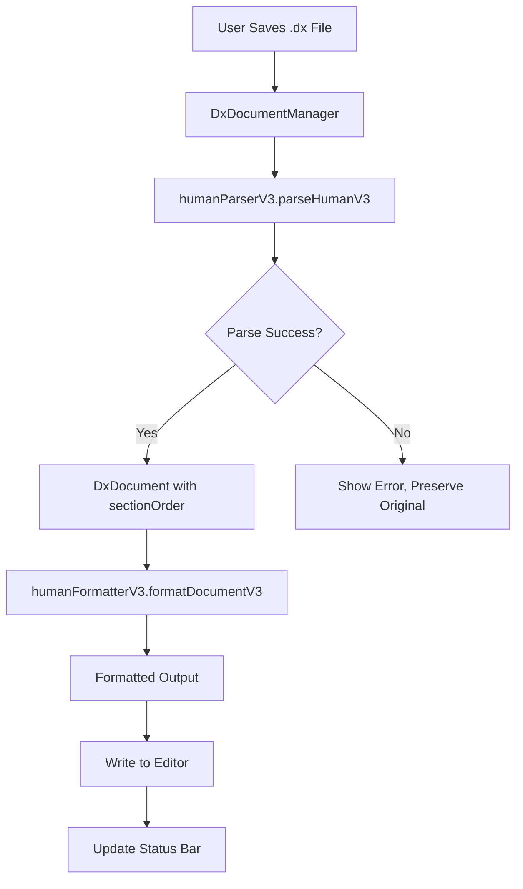

# Design Document: DX Editor Extensions - Format on Save

## Overview

This design enhances the existing VSCode DX Serializer extension to provide automatic table alignment formatting when `.dx` files are saved. The core improvement addresses issues with nested section formatting (like `[js.dependencies]`) and section name expansion (like `[driven]` instead of `[d]`).

The implementation modifies the existing `humanFormatterV3.ts` and `humanParserV3.ts` files to:
1. Properly handle nested sections with `parent.child` naming
2. Expand abbreviated section names to full human-readable names
3. Format keys without prefixes in nested sections
4. Recalculate table alignment on every save

## Architecture



## Components and Interfaces

### Extended Section Name Dictionary

The `SECTION_NAMES` dictionary needs to be extended to include all section types:

```typescript
export const SECTION_NAMES: Record<string, string> = {
    'c': 'config',
    'f': 'forge',
    'k': 'stack',
    'y': 'style',
    'u': 'ui',
    'm': 'media',
    'i': 'i18n',
    'o': 'icon',
    't': 'font',
    'd': 'driven',        // Changed from 'data'
    'g': 'generator',     // Added
    's': 'scripts',       // Added for scripts section
    'x': 'dependencies',  // Added for DX registry dependencies (secured)
    'j': 'js',            // Added for js.dependencies (external)
    'p': 'python',        // Added for python.dependencies (external)
    'r': 'rust',          // Added for rust.dependencies (external)
};
```

### Section Types

| Section | Description | Key Format | Value Format |
|---------|-------------|------------|--------------|
| `[scripts]` | Command aliases | command name | shell command |
| `[dependencies]` | DX registry packages (secured) | package name | version |
| `[js.dependencies]` | NPM packages (external) | package name | version |
| `[python.dependencies]` | PyPI packages (external) | package name | version |
| `[rust.dependencies]` | Cargo packages (external) | package name | version |

### Nested Section Handler

New component to handle `[parent.child]` section formatting:

```typescript
interface NestedSectionInfo {
    parent: string;      // e.g., 'js', 'python', 'rust'
    child: string;       // e.g., 'dependencies'
    fullName: string;    // e.g., 'js.dependencies'
}

function parseNestedSectionId(sectionId: string): NestedSectionInfo | null {
    // Handle sections stored as 'j' with 'dependencies_' prefixed keys
    // Return info to format as [js.dependencies] with clean keys
}

function formatNestedSection(
    section: DxSection,
    nestedInfo: NestedSectionInfo,
    config: HumanFormatV3Config
): string {
    // Format as [parent.child] with keys stripped of prefix
}
```

### Parser Enhancement

The parser needs to recognize nested sections and store them properly:

```typescript
// In humanParserV3.ts
function parseSectionHeaderV3(line: string): [string, string[], NestedSectionInfo?] | null {
    // Parse [js.dependencies] as parent='js', child='dependencies'
    // Return nested info for proper round-trip
}
```

## Data Models

### DxSection with Nested Info

```typescript
interface DxSection {
    id: string;           // Abbreviated section id (e.g., 'j')
    schema: string[];     // Column names
    rows: DxValue[][];    // Row data
    nestedChild?: string; // Optional child name (e.g., 'dependencies')
}
```

### Section Mapping for Dependencies

| Input Section | Stored As | Output Section |
|---------------|-----------|----------------|
| `[dependencies]` | `id: 'x'` | `[dependencies]` |
| `[js.dependencies]` | `id: 'j', nestedChild: 'dependencies'` | `[js.dependencies]` |
| `[python.dependencies]` | `id: 'p', nestedChild: 'dependencies'` | `[python.dependencies]` |
| `[rust.dependencies]` | `id: 'r', nestedChild: 'dependencies'` | `[rust.dependencies]` |
| `[scripts]` | `id: 's'` | `[scripts]` |
| `[driven]` | `id: 'd'` | `[driven]` |
| `[generator]` | `id: 'g'` | `[generator]` |

### Key Transformation for Nested Sections

| Input Key | Stored As | Output Key |
|-----------|-----------|------------|
| `react` in `[js.dependencies]` | `dependencies_react` | `react` |
| `next` in `[js.dependencies]` | `dependencies_next` | `next` |
| `django` in `[python.dependencies]` | `dependencies_django` | `django` |
| `dx-package-1` in `[dependencies]` | `dx-package-1` | `dx-package-1` |
| `status` in `[scripts]` | `status` | `status` |

### Hyphenated Key Support

Keys can contain hyphens (e.g., `dx-package-1`, `actix-web`, `rust-crypto`). The parser and formatter must:
- Preserve hyphens in key names
- Not confuse hyphens with null markers
- Handle hyphenated keys in all sections

## Algorithm: Format on Save

```
1. Parse current editor content using parseHumanV3()
2. If parse fails:
   a. Display error with line number
   b. Preserve original content
   c. Update status bar to show error
   d. Return without modification
3. If parse succeeds:
   a. Get DxDocument with sectionOrder
   b. Call formatDocumentV3() with config
   c. Replace editor content with formatted output
   d. Update status bar to show success
```

## Algorithm: Section Alignment

```
For each section:
1. Collect all key-value pairs in the section
2. Find the longest key length
3. Calculate padding = max(configuredMinPadding, longestKeyLength + 1)
4. For each key-value pair:
   a. Output: key + spaces(padding - keyLength) + "= " + value
```

## Algorithm: Stack Section Column Alignment

```
1. Parse all rows to find column count
2. For each column, find the maximum width
3. For each row:
   a. Pad key to align with other keys
   b. For each column value:
      - Pad value to column width
      - Join with " | "
```

## Correctness Properties

*A property is a characteristic or behavior that should hold true across all valid executions of a system—essentially, a formal statement about what the system should do. Properties serve as the bridge between human-readable specifications and machine-verifiable correctness guarantees.*

### Property 1: Round-Trip Consistency

*For any* valid DX document, parsing the document and then formatting it SHALL produce output that, when parsed again, yields a semantically equivalent document (same context values, same section data, same refs).

**Validates: Requirements 1.5, 4.1, 4.2, 4.3, 4.6**

### Property 2: Section Alignment Invariant

*For any* formatted DX output, all `=` signs within the same section SHALL be at the same column position.

**Validates: Requirements 1.4, 2.1, 2.2, 2.3, 2.4**

### Property 3: Padding Adjustment

*For any* DX document, if a key is added that is longer than all existing keys in a section, the formatted output SHALL have all `=` signs in that section shifted to accommodate the new longest key.

**Validates: Requirements 1.1, 1.2, 1.3**

### Property 4: Stack Column Alignment

*For any* `[stack]` section with multiple rows, each column SHALL be padded to the width of the longest value in that column, and all rows SHALL use ` | ` as the column separator.

**Validates: Requirements 3.1, 3.2, 3.3, 3.4**

### Property 5: Section Order Preservation

*For any* DX document with multiple sections, the formatted output SHALL preserve the order of sections as they appeared in the input.

**Validates: Requirements 4.4**

### Property 6: Nested Section Formatting

*For any* nested section like `[js.dependencies]`, the formatter SHALL output the full `[parent.child]` header and keys without the child prefix (e.g., `react` not `dependencies_react`).

**Validates: Requirements 7.1, 7.2, 7.3, 7.4, 8.5**

### Property 7: Section Name Expansion

*For any* abbreviated section ID, the formatter SHALL expand it to the full human-readable name (e.g., `d` → `driven`, `g` → `generator`), and custom section names not in the dictionary SHALL be preserved unchanged.

**Validates: Requirements 8.1, 8.4**

### Property 8: Invalid Input Preservation

*For any* input that fails parsing, the formatter SHALL return an error and NOT modify the original content.

**Validates: Requirements 5.1, 5.3**

## Error Handling

### Parse Errors

When parsing fails, the system returns a `HumanParseResultV3` with:
- `success: false`
- `error.message`: Description of the error
- `error.line`: Line number where error occurred
- `error.column`: Column position (if applicable)
- `error.hint`: Suggestion for fixing the error

### Error Display

The VSCode extension displays errors via:
1. Status bar indicator (warning icon)
2. Tooltip with error details
3. Original content preserved in editor

### Error Types

| Error Type | Message | Hint |
|------------|---------|------|
| Invalid section header | "Invalid section header at line X" | "Section headers should be [name] or [parent.child]" |
| Missing value | "Missing value after '=' at line X" | "Add a value after the equals sign" |
| Invalid UTF-8 | "File contains invalid UTF-8 encoding" | "Save file with UTF-8 encoding" |
| Unclosed quote | "Unclosed string quote at line X" | "Add closing quote" |

## Testing Strategy

### Unit Tests

Unit tests verify specific examples and edge cases:
- Single-key sections use minimum padding
- Empty sections format correctly
- Quoted strings with spaces preserved
- Numeric values preserved exactly
- Boolean values preserved
- Null markers (`-`, `~`) preserved

### Property-Based Tests

Property tests use `fast-check` library to verify universal properties:
- Minimum 100 iterations per property
- Each test references its design document property
- Tag format: **Feature: dx-editor-extensions, Property N: description**

### Test Configuration

```typescript
import fc from 'fast-check';

// Arbitrary for valid DX key names
const dxKeyArb = fc.stringOf(
    fc.constantFrom(...'abcdefghijklmnopqrstuvwxyz_'.split('')),
    { minLength: 1, maxLength: 20 }
);

// Arbitrary for valid DX values
const dxValueArb = fc.oneof(
    fc.string(),
    fc.integer(),
    fc.boolean(),
    fc.constant(null)
);

// Arbitrary for DX sections
const dxSectionArb = fc.record({
    name: fc.constantFrom('forge', 'style', 'ui', 'media', 'driven', 'generator'),
    keys: fc.array(dxKeyArb, { minLength: 1, maxLength: 10 }),
    values: fc.array(dxValueArb, { minLength: 1, maxLength: 10 })
});
```

### Test Files

- `humanFormatterV3.test.ts` - Formatter unit tests
- `humanParserV3.test.ts` - Parser unit tests  
- `humanFormatterV3.property.test.ts` - Property-based tests for formatter
- `roundtrip.property.test.ts` - Round-trip property tests
