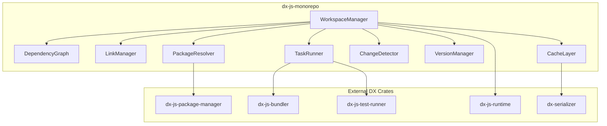

# Design Document: dx-js-monorepo

## Overview

`dx-js-monorepo` is a high-performance Rust crate that provides comprehensive JavaScript/TypeScript monorepo and workspace management for the DX ecosystem. It delivers Bun-compatible workspace support while achieving 10-50x performance improvements through DX's binary-first architecture.

The crate handles workspace discovery, dependency graph construction, package linking, task orchestration, change detection, and version management. It integrates seamlessly with `dx-js-package-manager`, `dx-js-bundler`, `dx-js-test-runner`, and `dx-js-runtime`.

### Key Design Principles

1. **Zero-copy parsing** - Memory-mapped file access for large workspaces
2. **Incremental computation** - Cache invalidation only for changed packages
3. **Parallel execution** - Concurrent operations for independent packages
4. **Binary serialization** - dx-serializer for fast state persistence
5. **Compatibility first** - Full npm/yarn/pnpm/Bun workspace compatibility

## Architecture

```
dx-js-monorepo/
├── Cargo.toml
├── src/
│   ├── lib.rs                    # Public API exports
│   ├── workspace/
│   │   ├── mod.rs                # Workspace module
│   │   ├── manager.rs            # WorkspaceManager implementation
│   │   ├── config.rs             # Configuration parsing
│   │   ├── discovery.rs          # Package discovery
│   │   └── validation.rs         # Schema validation
│   ├── graph/
│   │   ├── mod.rs                # Graph module
│   │   ├── dependency.rs         # DependencyGraph implementation
│   │   ├── topological.rs        # Topological sorting
│   │   └── cycle.rs              # Cycle detection
│   ├── link/
│   │   ├── mod.rs                # Link module
│   │   ├── manager.rs            # LinkManager implementation
│   │   ├── symlink.rs            # Symlink operations
│   │   └── bin.rs                # Binary linking
│   ├── resolve/
│   │   ├── mod.rs                # Resolution module
│   │   ├── resolver.rs           # PackageResolver implementation
│   │   ├── hoist.rs              # Hoisting logic
│   │   └── protocol.rs           # workspace: protocol handling
│   ├── task/
│   │   ├── mod.rs                # Task module
│   │   ├── runner.rs             # TaskRunner implementation
│   │   ├── executor.rs           # Script execution
│   │   └── output.rs             # Output streaming
│   ├── change/
│   │   ├── mod.rs                # Change detection module
│   │   ├── detector.rs           # ChangeDetector implementation
│   │   └── git.rs                # Git integration
│   ├── version/
│   │   ├── mod.rs                # Version module
│   │   ├── bump.rs               # Version bumping
│   │   └── publish.rs            # Publishing support
│   ├── cache/
│   │   ├── mod.rs                # Cache module
│   │   ├── memory.rs             # In-memory cache
│   │   └── persistent.rs         # Disk cache with dx-serializer
│   └── error.rs                  # Error types
├── tests/
│   ├── workspace_tests.rs
│   ├── graph_tests.rs
│   ├── link_tests.rs
│   └── integration_tests.rs
└── benches/
    └── workspace_bench.rs
```

### Component Diagram



## Components and Interfaces

### WorkspaceManager

The central coordinator for all workspace operations.

```rust
pub struct WorkspaceManager {
    root: PathBuf,
    config: WorkspaceConfig,
    packages: HashMap<String, Package>,
    graph: DependencyGraph,
    cache: CacheLayer,
}

impl WorkspaceManager {
    /// Create a new workspace manager from a root directory
    pub fn new(root: impl AsRef<Path>) -> Result<Self, WorkspaceError>;
    
    /// Discover all packages in the workspace
    pub fn discover(&mut self) -> Result<Vec<Package>, WorkspaceError>;
    
    /// Validate the workspace configuration
    pub fn validate(&self) -> Result<ValidationReport, WorkspaceError>;
    
    /// Get a package by name
    pub fn get_package(&self, name: &str) -> Option<&Package>;
    
    /// Get all packages
    pub fn packages(&self) -> impl Iterator<Item = &Package>;
    
    /// Get packages in topological order
    pub fn packages_topo(&self) -> Result<Vec<&Package>, WorkspaceError>;
    
    /// Get packages matching a filter pattern
    pub fn filter(&self, pattern: &str) -> Vec<&Package>;
    
    /// Get packages changed since a git ref
    pub fn changed_since(&self, git_ref: &str) -> Result<Vec<&Package>, WorkspaceError>;
}
```

### DependencyGraph

Manages the directed acyclic graph of package dependencies.

```rust
pub struct DependencyGraph {
    graph: DiGraph<PackageId, DependencyType>,
    node_map: HashMap<PackageId, NodeIndex>,
}

#[derive(Clone, Copy, PartialEq, Eq)]
pub enum DependencyType {
    Production,
    Development,
    Peer,
    Optional,
}

impl DependencyGraph {
    /// Create a new empty graph
    pub fn new() -> Self;
    
    /// Add a package to the graph
    pub fn add_package(&mut self, package: &Package) -> NodeIndex;
    
    /// Add a dependency edge between packages
    pub fn add_dependency(
        &mut self,
        from: &PackageId,
        to: &PackageId,
        dep_type: DependencyType,
    ) -> Result<(), GraphError>;
    
    /// Check for cycles and return the cycle path if found
    pub fn detect_cycle(&self) -> Option<Vec<PackageId>>;
    
    /// Get topological ordering of packages
    pub fn topological_order(&self) -> Result<Vec<PackageId>, GraphError>;
    
    /// Get all dependents of a package (packages that depend on it)
    pub fn dependents(&self, package: &PackageId) -> Vec<PackageId>;
    
    /// Get all dependencies of a package
    pub fn dependencies(&self, package: &PackageId) -> Vec<PackageId>;
    
    /// Get transitive dependencies
    pub fn transitive_dependencies(&self, package: &PackageId) -> Vec<PackageId>;
}
```

### LinkManager

Handles symlink creation and management for workspace packages.

```rust
pub struct LinkManager {
    root: PathBuf,
    links: HashMap<PathBuf, LinkInfo>,
}

pub struct LinkInfo {
    source: PathBuf,
    target: PathBuf,
    link_type: LinkType,
}

pub enum LinkType {
    Package,
    Binary,
}

impl LinkManager {
    /// Create a new link manager
    pub fn new(root: impl AsRef<Path>) -> Self;
    
    /// Link all workspace packages
    pub fn link_all(&mut self, packages: &[Package]) -> Result<LinkReport, LinkError>;
    
    /// Link a specific package to its dependents
    pub fn link_package(&mut self, package: &Package) -> Result<(), LinkError>;
    
    /// Unlink a package from all locations
    pub fn unlink_package(&mut self, package: &Package) -> Result<(), LinkError>;
    
    /// Verify all links are valid
    pub fn verify(&self) -> Result<Vec<LinkIssue>, LinkError>;
    
    /// Clean up stale links
    pub fn clean_stale(&mut self) -> Result<usize, LinkError>;
}
```

### PackageResolver

Resolves dependencies and handles hoisting.

```rust
pub struct PackageResolver {
    workspace_packages: HashMap<String, Package>,
    hoist_config: HoistConfig,
}

pub struct HoistConfig {
    enabled: bool,
    nohoist: Vec<String>,  // Glob patterns for packages to not hoist
}

pub struct ResolutionResult {
    hoisted: HashMap<String, ResolvedDep>,
    local: HashMap<PackageId, HashMap<String, ResolvedDep>>,
}

impl PackageResolver {
    /// Create a new resolver
    pub fn new(packages: HashMap<String, Package>, config: HoistConfig) -> Self;
    
    /// Resolve all workspace dependencies
    pub fn resolve(&self) -> Result<ResolutionResult, ResolveError>;
    
    /// Resolve workspace: protocol references
    pub fn resolve_workspace_protocol(
        &self,
        spec: &str,
        from_package: &PackageId,
    ) -> Result<ResolvedDep, ResolveError>;
    
    /// Determine which dependencies can be hoisted
    pub fn compute_hoisting(&self) -> HoistPlan;
}
```

### TaskRunner

Executes scripts across workspace packages.

```rust
pub struct TaskRunner {
    workspace: Arc<WorkspaceManager>,
    config: TaskConfig,
}

pub struct TaskConfig {
    parallel: bool,
    max_concurrency: usize,
    continue_on_error: bool,
    stream_output: bool,
}

pub struct TaskResult {
    package: PackageId,
    script: String,
    exit_code: i32,
    stdout: String,
    stderr: String,
    duration: Duration,
}

impl TaskRunner {
    /// Create a new task runner
    pub fn new(workspace: Arc<WorkspaceManager>, config: TaskConfig) -> Self;
    
    /// Run a script in all packages that define it
    pub async fn run_all(&self, script: &str) -> Result<Vec<TaskResult>, TaskError>;
    
    /// Run a script in filtered packages
    pub async fn run_filtered(
        &self,
        script: &str,
        filter: &str,
    ) -> Result<Vec<TaskResult>, TaskError>;
    
    /// Run a script in changed packages since a git ref
    pub async fn run_changed(
        &self,
        script: &str,
        since: &str,
    ) -> Result<Vec<TaskResult>, TaskError>;
}
```

### ChangeDetector

Detects which packages have changed.

```rust
pub struct ChangeDetector {
    workspace: Arc<WorkspaceManager>,
    git_root: PathBuf,
}

pub struct ChangeSet {
    directly_changed: HashSet<PackageId>,
    transitively_affected: HashSet<PackageId>,
    changed_files: HashMap<PackageId, Vec<PathBuf>>,
}

impl ChangeDetector {
    /// Create a new change detector
    pub fn new(workspace: Arc<WorkspaceManager>) -> Result<Self, ChangeError>;
    
    /// Detect changes since a git ref
    pub fn changes_since(&self, git_ref: &str) -> Result<ChangeSet, ChangeError>;
    
    /// Check if a specific package has changed
    pub fn has_changed(&self, package: &PackageId, git_ref: &str) -> Result<bool, ChangeError>;
    
    /// Get the list of changed files for a package
    pub fn changed_files(
        &self,
        package: &PackageId,
        git_ref: &str,
    ) -> Result<Vec<PathBuf>, ChangeError>;
}
```

## Data Models

### Package

```rust
#[derive(Debug, Clone, Serialize, Deserialize)]
pub struct Package {
    pub id: PackageId,
    pub name: String,
    pub version: Version,
    pub path: PathBuf,
    pub manifest: PackageManifest,
    pub private: bool,
}

#[derive(Debug, Clone, Hash, PartialEq, Eq, Serialize, Deserialize)]
pub struct PackageId(String);

impl PackageId {
    pub fn new(name: &str, path: &Path) -> Self;
    pub fn name(&self) -> &str;
}
```

### PackageManifest

```rust
#[derive(Debug, Clone, Serialize, Deserialize)]
pub struct PackageManifest {
    pub name: String,
    pub version: String,
    pub description: Option<String>,
    pub main: Option<String>,
    pub module: Option<String>,
    pub types: Option<String>,
    pub bin: Option<BinField>,
    pub scripts: HashMap<String, String>,
    pub dependencies: HashMap<String, String>,
    pub dev_dependencies: HashMap<String, String>,
    pub peer_dependencies: HashMap<String, String>,
    pub optional_dependencies: HashMap<String, String>,
    pub private: Option<bool>,
    pub workspaces: Option<WorkspacesField>,
}

#[derive(Debug, Clone, Serialize, Deserialize)]
#[serde(untagged)]
pub enum BinField {
    Single(String),
    Multiple(HashMap<String, String>),
}

#[derive(Debug, Clone, Serialize, Deserialize)]
#[serde(untagged)]
pub enum WorkspacesField {
    Array(Vec<String>),
    Object { packages: Vec<String>, nohoist: Option<Vec<String>> },
}
```

### WorkspaceConfig

```rust
#[derive(Debug, Clone, Serialize, Deserialize)]
pub struct WorkspaceConfig {
    pub root: PathBuf,
    pub format: WorkspaceFormat,
    pub globs: Vec<String>,
    pub nohoist: Vec<String>,
}

#[derive(Debug, Clone, Copy, PartialEq, Eq, Serialize, Deserialize)]
pub enum WorkspaceFormat {
    Npm,      // package.json workspaces field
    Pnpm,     // pnpm-workspace.yaml
    Bun,      // bun.lockb metadata
    Yarn,     // Same as Npm but with yarn.lock
}
```

### Version

```rust
#[derive(Debug, Clone, PartialEq, Eq, PartialOrd, Ord, Serialize, Deserialize)]
pub struct Version {
    pub major: u64,
    pub minor: u64,
    pub patch: u64,
    pub prerelease: Option<String>,
    pub build: Option<String>,
}

impl Version {
    pub fn parse(s: &str) -> Result<Self, VersionError>;
    pub fn bump(&self, bump_type: BumpType) -> Self;
    pub fn to_string(&self) -> String;
}

#[derive(Debug, Clone, Copy)]
pub enum BumpType {
    Major,
    Minor,
    Patch,
    Prerelease(Option<&'static str>),
}
```

### Error Types

```rust
#[derive(Debug, thiserror::Error)]
pub enum WorkspaceError {
    #[error("Failed to read workspace config: {0}")]
    ConfigRead(#[from] std::io::Error),
    
    #[error("Invalid workspace config at {path}: {message}")]
    ConfigInvalid { path: PathBuf, message: String },
    
    #[error("Package not found: {0}")]
    PackageNotFound(String),
    
    #[error("Circular dependency detected: {0:?}")]
    CircularDependency(Vec<PackageId>),
    
    #[error("Duplicate package name: {0}")]
    DuplicatePackage(String),
    
    #[error("Invalid workspace protocol: {0}")]
    InvalidProtocol(String),
    
    #[error("Git error: {0}")]
    Git(String),
    
    #[error("Link error: {0}")]
    Link(#[from] LinkError),
    
    #[error("Task error: {0}")]
    Task(#[from] TaskError),
}
```


## Correctness Properties

*A property is a characteristic or behavior that should hold true across all valid executions of a system—essentially, a formal statement about what the system should do. Properties serve as the bridge between human-readable specifications and machine-verifiable correctness guarantees.*

Based on the prework analysis, the following correctness properties have been identified. Redundant properties have been consolidated for efficiency.

### Property 1: Configuration Parsing Round-Trip

*For any* valid workspace configuration (package.json workspaces, pnpm-workspace.yaml, or bun.lockb), parsing the configuration and then serializing it back should produce an equivalent configuration structure.

**Validates: Requirements 1.1, 1.2, 1.3**

### Property 2: Glob Expansion Correctness

*For any* set of directories and any valid glob pattern, the set of discovered directories should exactly match the directories that satisfy the glob pattern according to standard glob semantics.

**Validates: Requirements 1.4, 1.5**

### Property 3: Malformed Config Error Reporting

*For any* malformed package.json file, the error message should contain the file path and a description of the parsing error.

**Validates: Requirements 1.7**

### Property 4: Dependency Graph Construction

*For any* set of packages with inter-package dependencies, the constructed dependency graph should contain exactly one node per package and exactly one edge for each declared dependency relationship.

**Validates: Requirements 2.1, 2.2, 2.3**

### Property 5: Workspace Protocol Resolution

*For any* workspace protocol reference (`workspace:*`, `workspace:^`, `workspace:~`), the resolved version should match the local package version with the appropriate semver semantics applied.

**Validates: Requirements 2.4, 2.5**

### Property 6: Cycle Detection

*For any* dependency graph containing a cycle, the cycle detection algorithm should return a non-empty path that forms a valid cycle (the last element depends on the first).

**Validates: Requirements 2.6**

### Property 7: Topological Order Validity

*For any* valid DAG (no cycles), the topological ordering should satisfy the invariant that for every edge (A → B), package A appears after package B in the ordering (dependencies before dependents).

**Validates: Requirements 2.7**

### Property 8: Dependents Query Correctness

*For any* package P in the graph, the set of dependents returned should be exactly the set of packages that have a direct dependency edge pointing to P.

**Validates: Requirements 2.8**

### Property 9: Symlink Creation Correctness

*For any* workspace dependency relationship, a symlink should exist in the dependent package's node_modules directory pointing to the dependency package, and the symlink target should be a relative path.

**Validates: Requirements 3.1, 3.2**

### Property 10: Binary Linking Correctness

*For any* package with a `bin` field, executable symlinks should exist in the `.bin` directory of each dependent package, and each symlink should point to the correct binary file.

**Validates: Requirements 3.3**

### Property 11: Link Consistency After Workspace Changes

*For any* workspace modification (package added or removed), the link state should be consistent: added packages should have links created in all dependents, and removed packages should have all links pointing to them removed.

**Validates: Requirements 3.5, 3.6, 3.7**

### Property 12: Hoisting Correctness

*For any* set of packages with shared dependencies, dependencies required at the same version by multiple packages should be hoisted to the root, while dependencies with version conflicts should remain in their respective package directories.

**Validates: Requirements 4.1, 4.2, 4.3**

### Property 13: Hoisting Disabled Behavior

*For any* workspace with hoisting disabled, no dependencies should be installed at the workspace root level; all dependencies should be in their respective package directories.

**Validates: Requirements 4.4**

### Property 14: Hoisting Safety

*For any* hoisting decision, the resulting dependency resolution should be equivalent to non-hoisted resolution—no package should resolve to a different version due to hoisting.

**Validates: Requirements 4.5, 4.6**

### Property 15: Task Filtering Correctness

*For any* task execution with filters (--workspace, --filter, --since), the set of packages where the script executes should be exactly the intersection of: packages that define the script AND packages matching the filter criteria.

**Validates: Requirements 5.1, 5.4, 5.7**

### Property 16: Task Execution Order

*For any* task execution across packages, if package A depends on package B, then B's task should complete before A's task starts (when not running in parallel mode for independent packages).

**Validates: Requirements 5.2, 5.3**

### Property 17: Task Output Prefixing

*For any* output line produced during task execution, the line should be prefixed with the package name that produced it.

**Validates: Requirements 5.6**

### Property 18: Task Error Handling

*For any* task execution where a script fails, the behavior should match the --continue-on-error flag: continue with remaining packages if true, stop immediately if false.

**Validates: Requirements 5.5, 5.8**

### Property 19: Change Detection Completeness

*For any* git ref, the change set should include all packages with directly changed files AND all packages that transitively depend on changed packages.

**Validates: Requirements 6.1, 6.2, 6.5**

### Property 20: Gitignore Respect

*For any* file matching a .gitignore pattern, changes to that file should not cause its containing package to be marked as changed.

**Validates: Requirements 6.4**

### Property 21: Shared Config Change Propagation

*For any* change to a shared configuration file (e.g., root tsconfig.json), all packages that reference or inherit from that configuration should be marked as changed.

**Validates: Requirements 6.3**

### Property 22: Validation Completeness

*For any* workspace with multiple validation errors, all errors should be returned (not just the first), and each error should include the file path where it occurred.

**Validates: Requirements 7.1, 7.2, 7.3, 7.4, 7.5**

### Property 23: Version Bump Correctness

*For any* version and bump type (major, minor, patch, prerelease), the resulting version should follow semver semantics: major increments reset minor and patch, minor increments reset patch, prerelease appends the tag correctly.

**Validates: Requirements 8.1, 8.4, 8.5**

### Property 24: Version Reference Update

*For any* package version change, all workspace: protocol references to that package should be updated to reflect the new version.

**Validates: Requirements 8.2**

### Property 25: Version Sync

*For any* workspace after a --sync operation, all non-private packages should have the same version.

**Validates: Requirements 8.3**

### Property 26: Formatting Preservation

*For any* package.json modification (version bump, reference update), the file's formatting (indentation, trailing newlines, key ordering) should be preserved.

**Validates: Requirements 8.6**

### Property 27: Publish Preparation Correctness

*For any* package prepared for publishing, all workspace: protocol references should be converted to actual version numbers, and the publish order should respect topological ordering (dependencies published before dependents).

**Validates: Requirements 9.1, 9.4, 9.5**

### Property 28: Private Package Exclusion

*For any* package with `"private": true`, it should never be included in the publish set.

**Validates: Requirements 9.2**

### Property 29: Dry Run Immutability

*For any* operation with --dry-run flag, no files should be modified and no network requests should be made.

**Validates: Requirements 9.3**

### Property 30: Cache Consistency

*For any* cached workspace state, the cache should be invalidated when the underlying package.json files change, and subsequent reads should return fresh data.

**Validates: Requirements 10.1, 10.2, 10.6**

### Property 31: Serialization Round-Trip

*For any* workspace state, serializing with dx-serializer and deserializing should produce an equivalent state.

**Validates: Requirements 10.5**

### Property 32: DX Config Parsing

*For any* valid dx.json workspace configuration, the configuration should be parsed correctly and produce the expected workspace settings.

**Validates: Requirements 11.5**

## Error Handling

### Error Categories

| Category | Error Type | Recovery Strategy |
|----------|------------|-------------------|
| Configuration | `ConfigInvalid` | Report all errors with locations, suggest fixes |
| Graph | `CircularDependency` | Report cycle path, suggest breaking point |
| Link | `LinkError` | Retry with junction points (Windows), report permissions |
| Task | `TaskError` | Continue or stop based on config, report exit codes |
| Git | `GitError` | Report git command failure, suggest git installation |
| Version | `VersionError` | Report invalid version format, suggest valid format |
| Publish | `PublishError` | Report registry errors, suggest authentication |

### Error Reporting Strategy

1. **Structured Errors**: All errors implement `std::error::Error` with source chains
2. **Location Information**: File paths and line numbers where applicable
3. **Actionable Messages**: Suggest fixes or next steps
4. **Batch Reporting**: Collect multiple errors before failing (validation)
5. **Exit Codes**: Distinct exit codes for different error categories

```rust
impl WorkspaceError {
    pub fn exit_code(&self) -> i32 {
        match self {
            Self::ConfigRead(_) | Self::ConfigInvalid { .. } => 1,
            Self::CircularDependency(_) => 2,
            Self::PackageNotFound(_) | Self::DuplicatePackage(_) => 3,
            Self::Link(_) => 4,
            Self::Task(_) => 5,
            Self::Git(_) => 6,
            _ => 1,
        }
    }
}
```

## Testing Strategy

### Dual Testing Approach

This crate uses both unit tests and property-based tests for comprehensive coverage:

- **Unit tests**: Verify specific examples, edge cases, and error conditions
- **Property tests**: Verify universal properties across all valid inputs

### Property-Based Testing Configuration

- **Library**: `proptest` crate for Rust
- **Iterations**: Minimum 100 iterations per property test
- **Shrinking**: Enabled for minimal failing examples
- **Tag Format**: `// Feature: dx-js-monorepo, Property N: {property_text}`

### Test Organization

```
tests/
├── unit/
│   ├── config_test.rs          # Configuration parsing unit tests
│   ├── graph_test.rs           # Graph construction unit tests
│   ├── link_test.rs            # Symlink operation unit tests
│   ├── resolve_test.rs         # Resolution unit tests
│   ├── task_test.rs            # Task execution unit tests
│   ├── change_test.rs          # Change detection unit tests
│   └── version_test.rs         # Version management unit tests
│
├── property/
│   ├── config_props.rs         # Property 1, 3
│   ├── glob_props.rs           # Property 2
│   ├── graph_props.rs          # Properties 4, 5, 6, 7, 8
│   ├── link_props.rs           # Properties 9, 10, 11
│   ├── hoist_props.rs          # Properties 12, 13, 14
│   ├── task_props.rs           # Properties 15, 16, 17, 18
│   ├── change_props.rs         # Properties 19, 20, 21
│   ├── validation_props.rs     # Property 22
│   ├── version_props.rs        # Properties 23, 24, 25, 26
│   ├── publish_props.rs        # Properties 27, 28, 29
│   └── cache_props.rs          # Properties 30, 31, 32
│
└── integration/
    ├── workspace_e2e.rs        # End-to-end workspace tests
    ├── npm_compat.rs           # npm workspace compatibility
    ├── pnpm_compat.rs          # pnpm workspace compatibility
    └── bun_compat.rs           # Bun workspace compatibility
```

### Test Generators

```rust
use proptest::prelude::*;

// Generate valid package names
fn package_name() -> impl Strategy<Value = String> {
    "[a-z][a-z0-9-]{0,20}"
}

// Generate valid semver versions
fn version() -> impl Strategy<Value = Version> {
    (0u64..100, 0u64..100, 0u64..100).prop_map(|(major, minor, patch)| {
        Version { major, minor, patch, prerelease: None, build: None }
    })
}

// Generate workspace configurations
fn workspace_config() -> impl Strategy<Value = WorkspaceConfig> {
    (
        vec(package_name(), 1..10),
        vec("[a-z]*/", 1..5),
    ).prop_map(|(packages, globs)| {
        // Build config from packages and globs
    })
}

// Generate dependency graphs (DAGs)
fn dependency_graph() -> impl Strategy<Value = DependencyGraph> {
    vec((package_name(), vec(package_name(), 0..5)), 1..20)
        .prop_filter("must be DAG", |edges| !has_cycle(edges))
        .prop_map(|edges| build_graph(edges))
}
```

### Benchmark Suite

```rust
// benches/workspace_bench.rs
use criterion::{criterion_group, criterion_main, Criterion};

fn bench_workspace_discovery(c: &mut Criterion) {
    c.bench_function("discover_100_packages", |b| {
        b.iter(|| WorkspaceManager::new("fixtures/large-workspace").unwrap().discover())
    });
}

fn bench_graph_construction(c: &mut Criterion) {
    c.bench_function("build_graph_100_packages", |b| {
        let packages = load_test_packages();
        b.iter(|| DependencyGraph::from_packages(&packages))
    });
}

fn bench_topological_sort(c: &mut Criterion) {
    c.bench_function("topo_sort_100_packages", |b| {
        let graph = load_test_graph();
        b.iter(|| graph.topological_order())
    });
}

criterion_group!(benches, bench_workspace_discovery, bench_graph_construction, bench_topological_sort);
criterion_main!(benches);
```

### Performance Targets

| Operation | Target | Measurement |
|-----------|--------|-------------|
| Workspace discovery (100 packages) | < 50ms | Cold start |
| Graph construction (100 packages) | < 10ms | From parsed packages |
| Topological sort (100 packages) | < 1ms | Cached graph |
| Change detection | < 100ms | Against HEAD~1 |
| Link creation (100 packages) | < 200ms | All symlinks |
| Cache load | < 5ms | From dx-serializer binary |
