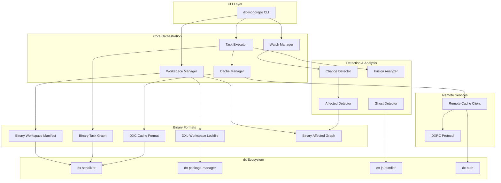

# Design Document: dx-js-monorepo

## Overview

dx-js-monorepo is a binary-first monorepo management system that achieves 30-100x performance improvements over traditional JSON-based tools (pnpm workspaces, Turborepo) by leveraging dx's proven binary architecture. The system eliminates all parsing overhead through:

- **Binary Workspace Manifest (BWM)**: Memory-mapped workspace structure with pre-computed dependency graphs
- **Binary Task Graph (BTG)**: Pre-compiled task pipelines with u32 indices and parallel execution maps
- **DXC Cache Format**: Zero-copy task output caching with XOR differential updates
- **DXL-Workspace Lockfile**: O(1) dependency resolution with CRDT merge support
- **SIMD Change Detection**: Blake3 hashing with AVX2 pattern matching for instant file analysis

The architecture builds on existing dx crates (dx-serializer, dx-package-manager, dx-js-bundler) to deliver unprecedented monorepo performance.

## Architecture



### Component Responsibilities

**Workspace Manager**: Loads and maintains the Binary Workspace Manifest, handles package.json synchronization, manages the dependency graph, and coordinates workspace-wide operations.

**Task Executor**: Loads the Binary Task Graph, schedules tasks respecting dependencies and parallelism, manages task lifecycle with frame budgets, and coordinates with the Fusion Analyzer for task merging.

**Cache Manager**: Manages local DXC cache storage, handles cache lookups with memory-mapped access, coordinates with Remote Cache Client for distributed caching, and performs Ed25519 signature verification.

**Change Detector**: Performs SIMD-accelerated Blake3 hashing, maintains Merkle hash trees, detects file modifications with incremental hashing, and generates binary fingerprints.

**Affected Detector**: Queries the Binary Affected Graph, maintains inverse dependency indices, computes transitive closures, and maps file paths to owning packages.

**Watch Manager**: Monitors file system events, coordinates predictive task execution, manages debouncing and change coalescing, and triggers incremental rebuilds.

**Fusion Analyzer**: Analyzes task pipelines for merge opportunities, identifies shared work across tasks, and coordinates fused execution with resource sharing.

**Ghost Detector**: Scans imports using SIMD, cross-references with declared dependencies, identifies hoisting accidents, and checks vulnerability databases.

**Remote Cache Client**: Implements DXRC binary protocol, handles XOR patch streaming, manages speculative prefetching, and supports resume-capable downloads.

## Components and Interfaces

### Binary Workspace Manifest (BWM)

```rust
/// Binary Workspace Manifest - the complete workspace structure in dx-serializer format
pub struct BinaryWorkspaceManifest {
    /// Magic bytes for format identification: "DXWM"
    magic: [u8; 4],
    /// Format version for compatibility
    version: u32,
    /// Total number of packages in workspace
    package_count: u32,
    /// Offset to package metadata table
    packages_offset: u64,
    /// Offset to dependency graph
    graph_offset: u64,
    /// Offset to topological order array
    topo_order_offset: u64,
    /// Offset to string table
    strings_offset: u64,
    /// Blake3 hash of content for integrity verification
    content_hash: [u8; 32],
}

/// Package entry in the manifest (fixed-size for O(1) indexing)
pub struct PackageEntry {
    /// Index into string table for package name
    name_idx: u32,
    /// Index into string table for package path
    path_idx: u32,
    /// Package version encoded as (major << 20) | (minor << 10) | patch
    version_packed: u32,
    /// Offset to dependency list
    deps_offset: u32,
    /// Number of dependencies
    deps_count: u16,
    /// Offset to script definitions
    scripts_offset: u32,
    /// Number of scripts
    scripts_count: u16,
    /// Flags: is_private, has_bin, etc.
    flags: u16,
}

/// Workspace Manager interface
pub trait WorkspaceManager {
    /// Load workspace manifest from memory-mapped file
    fn load(&mut self, path: &Path) -> Result<(), WorkspaceError>;
    
    /// Get package by name with O(1) lookup
    fn get_package(&self, name: &str) -> Option<&PackageEntry>;
    
    /// Get package by index
    fn get_package_by_index(&self, idx: u32) -> Option<&PackageEntry>;
    
    /// Get all packages in topological order
    fn topological_order(&self) -> &[u32];
    
    /// Get direct dependencies of a package
    fn dependencies(&self, pkg_idx: u32) -> &[u32];
    
    /// Incrementally update manifest when package.json changes
    fn update_package(&mut self, path: &Path) -> Result<(), WorkspaceError>;
    
    /// Regenerate entire manifest from source files
    fn regenerate(&mut self) -> Result<(), WorkspaceError>;
}
```

### Binary Task Graph (BTG)

```rust
/// Binary Task Graph - pre-compiled task pipeline
pub struct BinaryTaskGraph {
    /// Magic bytes: "DXTG"
    magic: [u8; 4],
    /// Format version
    version: u32,
    /// Total number of task definitions
    task_count: u32,
    /// Offset to task entries
    tasks_offset: u64,
    /// Offset to dependency edges (u32 pairs)
    edges_offset: u64,
    /// Number of edges
    edge_count: u32,
    /// Offset to parallel execution groups
    parallel_groups_offset: u64,
    /// Offset to topological order
    topo_order_offset: u64,
}

/// Task entry (fixed-size for O(1) access)
pub struct TaskEntry {
    /// Index into string table for task name (e.g., "build", "test")
    name_idx: u32,
    /// Package index this task belongs to
    package_idx: u32,
    /// Index into string table for command
    command_idx: u32,
    /// Offset to input glob patterns
    inputs_offset: u32,
    /// Number of input patterns
    inputs_count: u16,
    /// Offset to output glob patterns
    outputs_offset: u32,
    /// Number of output patterns
    outputs_count: u16,
    /// Pre-computed hash of task definition
    definition_hash: [u8; 8],
    /// Flags: cacheable, persistent, etc.
    flags: u16,
    /// Frame budget in microseconds (0 = unlimited)
    frame_budget_us: u32,
}

/// Task Executor interface
pub trait TaskExecutor {
    /// Load task graph from memory-mapped file
    fn load(&mut self, path: &Path) -> Result<(), TaskError>;
    
    /// Get task by package and name
    fn get_task(&self, package_idx: u32, name: &str) -> Option<&TaskEntry>;
    
    /// Get tasks that can run in parallel at current stage
    fn parallel_tasks(&self, completed: &BitSet) -> Vec<u32>;
    
    /// Execute a task, respecting frame budget
    fn execute(&mut self, task_idx: u32) -> Result<TaskOutput, TaskError>;
    
    /// Clone a task template for execution (zero-allocation)
    fn clone_task(&self, task_idx: u32) -> TaskInstance;
    
    /// Check if task should yield due to frame budget
    fn should_yield(&self, task: &TaskInstance) -> bool;
}

/// Task instance for execution (stack-allocated)
pub struct TaskInstance {
    task_idx: u32,
    start_time_ns: u64,
    state: TaskState,
    /// Inline storage for small outputs
    inline_output: [u8; 64],
    inline_len: u8,
}
```

### Change Detector with SIMD

```rust
/// Change Detector using SIMD-accelerated Blake3
pub trait ChangeDetector {
    /// Hash a single file using Blake3 SIMD
    fn hash_file(&self, path: &Path) -> Result<[u8; 32], IoError>;
    
    /// Hash multiple files in parallel
    fn hash_files_parallel(&self, paths: &[PathBuf]) -> Result<Vec<FileHash>, IoError>;
    
    /// Incrementally hash only changed regions of a file
    fn hash_incremental(&self, path: &Path, previous: &FileHash) -> Result<[u8; 32], IoError>;
    
    /// Build Merkle tree for a directory
    fn build_merkle_tree(&self, dir: &Path) -> Result<MerkleTree, IoError>;
    
    /// Generate 64-byte binary fingerprint
    fn fingerprint(&self, path: &Path) -> Result<[u8; 64], IoError>;
    
    /// Detect imports using AVX2 pattern matching
    fn detect_imports_simd(&self, content: &[u8]) -> Vec<ImportStatement>;
}

/// File hash with metadata
pub struct FileHash {
    path_hash: u64,
    content_hash: [u8; 32],
    size: u64,
    mtime_ns: u64,
}

/// Merkle tree node
pub struct MerkleNode {
    hash: [u8; 32],
    children_offset: u32,
    children_count: u16,
    is_file: bool,
}
```

### Cache Manager with DXC Format

```rust
/// DXC Cache entry header
pub struct DxcHeader {
    /// Magic bytes: "DXC\0"
    magic: [u8; 4],
    /// Format version
    version: u32,
    /// Task hash that produced this cache
    task_hash: [u8; 32],
    /// Ed25519 signature of content
    signature: [u8; 64],
    /// Public key used for signing
    public_key: [u8; 32],
    /// Uncompressed size
    uncompressed_size: u64,
    /// Compressed size (0 if uncompressed)
    compressed_size: u64,
    /// Number of output files
    file_count: u32,
    /// Offset to file entries
    files_offset: u64,
}

/// Cache Manager interface
pub trait CacheManager {
    /// Check if cache entry exists (< 0.1ms)
    fn has(&self, task_hash: &[u8; 32]) -> bool;
    
    /// Get cached output with zero-copy access (< 0.5ms)
    fn get(&self, task_hash: &[u8; 32]) -> Option<CacheEntry>;
    
    /// Store task output in cache
    fn put(&mut self, task_hash: &[u8; 32], output: &TaskOutput) -> Result<(), CacheError>;
    
    /// Apply XOR patch to update cache entry
    fn apply_patch(&mut self, task_hash: &[u8; 32], patch: &XorPatch) -> Result<(), CacheError>;
    
    /// Verify Ed25519 signature of cache entry
    fn verify(&self, entry: &CacheEntry) -> Result<bool, CacheError>;
    
    /// Enable zero-disk mode with virtual filesystem
    fn enable_zero_disk(&mut self) -> Result<(), CacheError>;
}

/// XOR patch for differential updates
pub struct XorPatch {
    base_hash: [u8; 32],
    target_hash: [u8; 32],
    /// Sparse XOR blocks: (offset, length, xor_data)
    blocks: Vec<(u64, u32, Vec<u8>)>,
}
```

### Binary Lockfile (DXL-Workspace)

```rust
/// DXL-Workspace lockfile header
pub struct DxlWorkspaceHeader {
    /// Magic bytes: "DXLW"
    magic: [u8; 4],
    /// Format version
    version: u32,
    /// Number of resolved packages
    package_count: u32,
    /// Offset to package index (for O(1) lookup)
    index_offset: u64,
    /// Offset to package entries
    entries_offset: u64,
    /// Offset to peer dependency conflict matrix
    conflicts_offset: u64,
    /// Offset to hoisting strategy
    hoisting_offset: u64,
    /// CRDT vector clock for merge support
    vector_clock: [u64; 8],
}

/// Lockfile Resolver interface
pub trait LockfileResolver {
    /// Load lockfile from memory-mapped file
    fn load(&mut self, path: &Path) -> Result<(), LockfileError>;
    
    /// Resolve package with O(1) lookup
    fn resolve(&self, name: &str, version_req: &str) -> Option<&ResolvedPackage>;
    
    /// Get pre-resolved workspace protocol reference
    fn resolve_workspace(&self, name: &str) -> Option<&ResolvedPackage>;
    
    /// Check peer dependency conflicts
    fn check_peer_conflicts(&self, pkg: &ResolvedPackage) -> Vec<PeerConflict>;
    
    /// Get optimal hoisting strategy
    fn hoisting_strategy(&self) -> &HoistingStrategy;
    
    /// Merge with another lockfile using CRDT semantics
    fn merge(&mut self, other: &DxlWorkspaceHeader) -> Result<(), MergeError>;
}

/// Resolved package entry
pub struct ResolvedPackage {
    name_idx: u32,
    version_packed: u32,
    integrity_hash: [u8; 32],
    tarball_url_idx: u32,
    dependencies_offset: u32,
    dependencies_count: u16,
}
```

### Remote Cache Protocol (DXRC)

```rust
/// DXRC request message
pub struct DxrcRequest {
    /// Request type
    request_type: DxrcRequestType,
    /// Task hashes to fetch
    task_hashes: Vec<[u8; 32]>,
    /// Client's current cache state (for differential sync)
    client_state: Option<CacheState>,
    /// Prefetch hints
    prefetch_hints: Vec<[u8; 32]>,
}

pub enum DxrcRequestType {
    /// Fetch cache entries
    Fetch,
    /// Store cache entries
    Store,
    /// Check existence
    Exists,
    /// Resume interrupted download
    Resume { checkpoint: ResumeCheckpoint },
}

/// Remote Cache Client interface
pub trait RemoteCacheClient {
    /// Fetch multiple cache entries in single request
    fn fetch(&self, hashes: &[[u8; 32]]) -> Result<Vec<CacheEntry>, RemoteError>;
    
    /// Store cache entries with XOR patch optimization
    fn store(&self, entries: &[CacheEntry]) -> Result<(), RemoteError>;
    
    /// Start speculative prefetch
    fn prefetch(&self, predicted_hashes: &[[u8; 32]]);
    
    /// Resume interrupted download
    fn resume(&self, checkpoint: &ResumeCheckpoint) -> Result<CacheEntry, RemoteError>;
    
    /// Get connection for multiplexed transfers
    fn connection(&self) -> &MultiplexedConnection;
}
```

### Affected Detector with BAG

```rust
/// Binary Affected Graph header
pub struct BinaryAffectedGraph {
    /// Magic bytes: "DXAG"
    magic: [u8; 4],
    /// Format version
    version: u32,
    /// Number of packages
    package_count: u32,
    /// Offset to inverse dependency index
    inverse_deps_offset: u64,
    /// Offset to transitive closure cache
    transitive_offset: u64,
    /// Offset to file-to-package mapping
    file_map_offset: u64,
}

/// Affected Detector interface
pub trait AffectedDetector {
    /// Get packages affected by changes (< 5ms)
    fn affected(&self, changed_files: &[PathBuf]) -> Vec<u32>;
    
    /// Get packages that depend on given package (O(1))
    fn dependents(&self, package_idx: u32) -> &[u32];
    
    /// Get full transitive dependents
    fn transitive_dependents(&self, package_idx: u32) -> &[u32];
    
    /// Map file path to owning package
    fn file_to_package(&self, path: &Path) -> Option<u32>;
    
    /// Analyze imports using SIMD
    fn analyze_imports(&self, path: &Path) -> Vec<ImportDependency>;
}
```

### Fusion Analyzer

```rust
/// Fusion analysis result
pub struct FusionPlan {
    /// Groups of tasks that can be fused
    fused_groups: Vec<FusedTaskGroup>,
    /// Estimated speedup factor
    estimated_speedup: f32,
}

pub struct FusedTaskGroup {
    /// Task indices in this group
    tasks: Vec<u32>,
    /// Shared resources
    shared_file_handles: Vec<PathBuf>,
    /// Memory budget for shared allocation
    memory_budget: usize,
}

/// Fusion Analyzer interface
pub trait FusionAnalyzer {
    /// Analyze task pipeline for fusion opportunities
    fn analyze(&self, tasks: &[u32]) -> FusionPlan;
    
    /// Check if two tasks are fusible
    fn can_fuse(&self, task_a: u32, task_b: u32) -> bool;
    
    /// Execute fused task group
    fn execute_fused(&mut self, group: &FusedTaskGroup) -> Result<Vec<TaskOutput>, TaskError>;
}
```

### Ghost Detector

```rust
/// Ghost dependency report
pub struct GhostReport {
    /// Undeclared dependencies found
    ghosts: Vec<GhostDependency>,
    /// Hoisting accidents
    hoisting_accidents: Vec<HoistingAccident>,
    /// Known vulnerabilities in ghost deps
    vulnerabilities: Vec<Vulnerability>,
}

pub struct GhostDependency {
    /// Package name being imported
    package_name: String,
    /// File containing the import
    importing_file: PathBuf,
    /// Line number of import
    line: u32,
    /// Column of import
    column: u32,
}

/// Ghost Detector interface
pub trait GhostDetector {
    /// Scan workspace for ghost dependencies
    fn scan(&self) -> Result<GhostReport, ScanError>;
    
    /// Scan single package
    fn scan_package(&self, package_idx: u32) -> Result<Vec<GhostDependency>, ScanError>;
    
    /// Check if import is declared
    fn is_declared(&self, package_idx: u32, import: &str) -> bool;
}
```

### Watch Manager

```rust
/// Watch Manager interface
pub trait WatchManager {
    /// Start watching workspace
    fn start(&mut self) -> Result<(), WatchError>;
    
    /// Stop watching
    fn stop(&mut self);
    
    /// Set predictive execution callback
    fn on_predicted_change(&mut self, callback: Box<dyn Fn(&Path) -> Vec<u32>>);
    
    /// Configure debounce settings
    fn set_debounce(&mut self, config: DebounceConfig);
    
    /// Get pending changes (coalesced)
    fn pending_changes(&self) -> Vec<FileChange>;
}

pub struct DebounceConfig {
    /// Minimum wait time before triggering
    min_wait_ms: u32,
    /// Maximum wait time
    max_wait_ms: u32,
    /// Coalesce rapid changes to same file
    coalesce: bool,
}

pub struct FileChange {
    path: PathBuf,
    change_type: ChangeType,
    timestamp_ns: u64,
}
```

## Data Models

### Workspace Configuration

```rust
/// Workspace configuration (dx.workspace.toml)
pub struct WorkspaceConfig {
    /// Workspace name
    pub name: String,
    /// Package glob patterns
    pub packages: Vec<String>,
    /// Task pipeline definitions
    pub tasks: HashMap<String, TaskConfig>,
    /// Cache configuration
    pub cache: CacheConfig,
    /// Remote cache settings
    pub remote_cache: Option<RemoteCacheConfig>,
}

pub struct TaskConfig {
    /// Command to execute
    pub command: String,
    /// Task dependencies
    pub depends_on: Vec<String>,
    /// Input file patterns
    pub inputs: Vec<String>,
    /// Output file patterns
    pub outputs: Vec<String>,
    /// Whether task output is cacheable
    pub cache: bool,
    /// Frame budget in milliseconds
    pub frame_budget_ms: Option<u32>,
}

pub struct CacheConfig {
    /// Cache directory
    pub dir: PathBuf,
    /// Maximum cache size in bytes
    pub max_size: u64,
    /// Enable zero-disk mode
    pub zero_disk: bool,
}

pub struct RemoteCacheConfig {
    /// Remote cache URL
    pub url: String,
    /// Authentication token
    pub token: Option<String>,
    /// Enable speculative prefetch
    pub prefetch: bool,
}
```

### Error Types

```rust
pub enum WorkspaceError {
    ManifestNotFound,
    ManifestCorrupted { hash_mismatch: bool },
    PackageNotFound { name: String },
    CyclicDependency { cycle: Vec<String> },
    IoError(std::io::Error),
}

pub enum TaskError {
    TaskNotFound { package: String, task: String },
    DependencyFailed { task: u32, error: Box<TaskError> },
    FrameBudgetExceeded { task: u32, elapsed_us: u64 },
    ExecutionFailed { exit_code: i32, stderr: String },
}

pub enum CacheError {
    EntryNotFound,
    SignatureInvalid,
    IntegrityCheckFailed,
    StorageFull,
    IoError(std::io::Error),
}

pub enum LockfileError {
    NotFound,
    Corrupted,
    MergeConflict { conflicts: Vec<String> },
    VersionMismatch { expected: u32, found: u32 },
}
```

### Performance Metrics

```rust
/// Performance tracking for validation
pub struct PerformanceMetrics {
    /// Workspace load time in microseconds
    pub workspace_load_us: u64,
    /// Task graph load time in microseconds
    pub task_graph_load_us: u64,
    /// Cache lookup time in microseconds
    pub cache_lookup_us: u64,
    /// File hash time for N files in microseconds
    pub file_hash_us: u64,
    pub file_hash_count: u32,
    /// Affected detection time in microseconds
    pub affected_detection_us: u64,
}
```


## Correctness Properties

*A property is a characteristic or behavior that should hold true across all valid executions of a system—essentially, a formal statement about what the system should do. Properties serve as the bridge between human-readable specifications and machine-verifiable correctness guarantees.*

### Property 1: Binary Workspace Manifest Round-Trip Consistency

*For any* valid workspace configuration with N packages, serializing to BWM format and deserializing SHALL produce an equivalent workspace structure with identical dependency graphs, package metadata, and topological ordering.

**Validates: Requirements 1.3, 1.4, 1.5**

### Property 2: Topological Order Validity

*For any* Binary Workspace Manifest or Binary Task Graph, the stored topological order SHALL satisfy the invariant that for every dependency edge (A → B), the index of A in the topological order is less than the index of B.

**Validates: Requirements 1.3, 2.3**

### Property 3: Incremental Manifest Update Isolation

*For any* workspace manifest and single package.json modification, the incremental update SHALL modify only the affected package entry and its direct dependents while leaving all other package entries byte-identical.

**Validates: Requirements 1.2**

### Property 4: O(1) Lookup Time Invariance

*For any* Binary Workspace Manifest, DXL-Workspace lockfile, or Binary Affected Graph, the lookup time for a single entry SHALL remain constant (within 10% variance) regardless of the total number of entries in the structure.

**Validates: Requirements 1.4, 5.1, 7.2**

### Property 5: Task Graph Parallel Execution Map Correctness

*For any* Binary Task Graph, the parallel execution map SHALL correctly identify all tasks that have no mutual dependencies and can execute simultaneously, such that executing tasks in parallel groups produces identical outputs to sequential execution.

**Validates: Requirements 2.4**

### Property 6: Task Cloning Zero-Allocation

*For any* task instantiation via clone_task(), the operation SHALL complete without heap allocations, using only stack-allocated TaskInstance structures.

**Validates: Requirements 2.5, 2.6**

### Property 7: Frame Budget Yield Behavior

*For any* task with a configured frame budget, if execution time exceeds the budget, the Task_Executor SHALL yield within 1ms of the budget threshold and resume in the next scheduling slot.

**Validates: Requirements 2.7**

### Property 8: Blake3 Hash Determinism

*For any* file content, the Change_Detector's Blake3 SIMD hashing SHALL produce identical 32-byte hashes regardless of the number of parallel threads or SIMD instruction set used.

**Validates: Requirements 3.1**

### Property 9: Import Detection Completeness

*For any* JavaScript/TypeScript file, the SIMD-accelerated import detection SHALL identify all import statements (ES6 imports, CommonJS requires, dynamic imports) with correct file paths and line numbers.

**Validates: Requirements 3.4, 7.5**

### Property 10: Binary Fingerprint Size Invariance

*For any* input file of any size, the Change_Detector SHALL generate exactly 64-byte binary fingerprints.

**Validates: Requirements 3.5**

### Property 11: DXC Cache Round-Trip Consistency

*For any* TaskOutput, storing in DXC format and retrieving SHALL produce byte-identical output content with valid Ed25519 signatures.

**Validates: Requirements 4.3, 4.5**

### Property 12: XOR Patch Efficiency

*For any* two cache entries or remote transfers with >50% byte similarity, the XOR differential patch SHALL be smaller than 50% of the full entry size.

**Validates: Requirements 4.4, 6.2**

### Property 13: Cache Signature Tamper Detection

*For any* DXC cache entry, modifying any byte of the content SHALL cause signature verification to fail.

**Validates: Requirements 4.5**

### Property 14: DXL-Workspace Round-Trip Consistency

*For any* valid lockfile state, serializing to DXL-Workspace format and deserializing SHALL produce an equivalent lockfile with identical package resolutions and dependency relationships.

**Validates: Requirements 5.6**

### Property 15: CRDT Merge Commutativity

*For any* two DXL-Workspace lockfiles A and B, merge(A, B) SHALL produce the same result as merge(B, A), and the result SHALL be a valid lockfile.

**Validates: Requirements 5.5**

### Property 16: Workspace Protocol Resolution Completeness

*For any* workspace with workspace:* references, the serialized BWM and DXL-Workspace SHALL contain no unresolved workspace protocol references—all SHALL be resolved to concrete versions.

**Validates: Requirements 1.5, 5.2**

### Property 17: Single Request Multi-Entry Fetch

*For any* request to fetch N cache entries from remote cache, the Remote_Cache_Client SHALL complete the operation using exactly 1 network request (excluding retries).

**Validates: Requirements 6.1, 6.4**

### Property 18: Affected Package Transitivity

*For any* file change in package P, the Affected_Detector SHALL return all packages in the transitive closure of dependents of P, with no false negatives.

**Validates: Requirements 7.1, 7.3, 7.4**

### Property 19: Inverse Dependency Index Correctness

*For any* package P in the Binary Affected Graph, the inverse dependency index SHALL return exactly the set of packages that have P as a direct dependency.

**Validates: Requirements 7.2**

### Property 20: Fusion Output Equivalence

*For any* set of fusible tasks, executing them via Fusion_Executor SHALL produce outputs byte-identical to executing them sequentially and independently.

**Validates: Requirements 8.4**

### Property 21: Ghost Detection Accuracy

*For any* workspace, the Ghost_Detector SHALL identify all imports that reference packages not declared in the importing package's dependencies, with no false positives for declared dependencies.

**Validates: Requirements 9.1, 9.2, 9.3**

### Property 22: Ghost Report Completeness

*For any* detected ghost dependency, the report SHALL include the exact package name, importing file path, line number, and column number.

**Validates: Requirements 9.3**

### Property 23: Watch Event Coalescing

*For any* sequence of N rapid file changes to the same file within the debounce window, the Watch_Manager SHALL trigger exactly 1 rebuild operation.

**Validates: Requirements 10.3**

### Property 24: Cross-Package Rebuild Deduplication

*For any* file change affecting multiple packages, the Watch_Manager SHALL trigger each affected task at most once, preventing redundant rebuilds.

**Validates: Requirements 10.5**

## Error Handling

### Workspace Errors

| Error | Cause | Recovery |
|-------|-------|----------|
| ManifestNotFound | BWM file doesn't exist | Regenerate from package.json files |
| ManifestCorrupted | Hash mismatch or invalid structure | Regenerate from source, log warning |
| PackageNotFound | Referenced package doesn't exist | Return error with package name |
| CyclicDependency | Circular dependency detected | Return error with cycle path |

### Task Errors

| Error | Cause | Recovery |
|-------|-------|----------|
| TaskNotFound | Task doesn't exist in graph | Return error with task identifier |
| DependencyFailed | Upstream task failed | Propagate error, skip dependent tasks |
| FrameBudgetExceeded | Task exceeded time limit | Yield and reschedule |
| ExecutionFailed | Non-zero exit code | Return error with stderr |

### Cache Errors

| Error | Cause | Recovery |
|-------|-------|----------|
| EntryNotFound | Cache miss | Execute task, store result |
| SignatureInvalid | Tampered or corrupted entry | Delete entry, re-execute task |
| IntegrityCheckFailed | Content hash mismatch | Delete entry, re-execute task |
| StorageFull | Cache directory full | Evict LRU entries |

### Lockfile Errors

| Error | Cause | Recovery |
|-------|-------|----------|
| NotFound | Lockfile doesn't exist | Generate new lockfile |
| Corrupted | Invalid binary structure | Regenerate from package.json |
| MergeConflict | CRDT merge failed | Return conflicts for manual resolution |
| VersionMismatch | Incompatible format version | Migrate or regenerate |

### Remote Cache Errors

| Error | Cause | Recovery |
|-------|-------|----------|
| ConnectionFailed | Network unavailable | Fall back to local cache |
| AuthenticationFailed | Invalid token | Prompt for re-authentication |
| TransferInterrupted | Network dropped | Resume from checkpoint |
| ServerError | Remote server issue | Retry with exponential backoff |

## Testing Strategy

### Property-Based Testing Framework

The implementation SHALL use `proptest` for Rust property-based testing with the following configuration:

- Minimum 100 iterations per property test
- Custom generators for workspace structures, task graphs, and cache entries
- Shrinking enabled for minimal counterexamples

### Unit Tests

Unit tests SHALL cover:
- Specific examples demonstrating correct behavior for each component
- Edge cases: empty workspaces, single-package workspaces, maximum-size structures
- Error conditions: corrupted files, missing dependencies, invalid configurations
- Boundary values: frame budget thresholds, cache size limits

### Property Tests

Each correctness property SHALL be implemented as a property-based test:

```rust
// Example: Property 1 - BWM Round-Trip
#[test]
fn prop_bwm_round_trip() {
    // Feature: dx-js-monorepo, Property 1: Binary Workspace Manifest Round-Trip Consistency
    proptest!(|(workspace in arb_workspace_config())| {
        let serialized = BWMSerializer::serialize(&workspace)?;
        let deserialized = BWMSerializer::deserialize(&serialized)?;
        prop_assert_eq!(workspace, deserialized);
    });
}

// Example: Property 2 - Topological Order Validity
#[test]
fn prop_topological_order_valid() {
    // Feature: dx-js-monorepo, Property 2: Topological Order Validity
    proptest!(|(graph in arb_dependency_graph())| {
        let bwm = BWMSerializer::serialize(&graph)?;
        let topo_order = bwm.topological_order();
        for (a, b) in graph.edges() {
            let idx_a = topo_order.iter().position(|&x| x == a).unwrap();
            let idx_b = topo_order.iter().position(|&x| x == b).unwrap();
            prop_assert!(idx_a < idx_b, "Dependency {} must come before {}", a, b);
        }
    });
}
```

### Test Generators

Custom generators for property tests:

```rust
// Workspace configuration generator
fn arb_workspace_config() -> impl Strategy<Value = WorkspaceConfig> {
    (1..100usize).prop_flat_map(|n| {
        vec(arb_package_config(), n).prop_map(|packages| {
            WorkspaceConfig::from_packages(packages)
        })
    })
}

// Dependency graph generator (acyclic)
fn arb_dependency_graph() -> impl Strategy<Value = DependencyGraph> {
    (1..500usize).prop_flat_map(|n| {
        // Generate DAG by only allowing edges from lower to higher indices
        let edges = (0..n).prop_flat_map(move |i| {
            vec((Just(i), (i+1)..n), 0..5)
        });
        edges.prop_map(DependencyGraph::from_edges)
    })
}

// Cache entry generator
fn arb_cache_entry() -> impl Strategy<Value = CacheEntry> {
    (arb_task_hash(), vec(any::<u8>(), 0..1_000_000))
        .prop_map(|(hash, content)| CacheEntry::new(hash, content))
}
```

### Integration Tests

Integration tests SHALL verify:
- End-to-end workspace loading and task execution
- Remote cache synchronization with mock server
- Watch mode with simulated file changes
- Fusion mode with real TypeScript compilation

### Performance Benchmarks

Benchmarks SHALL validate performance requirements:
- Workspace load time vs package count
- Task graph load time vs node count
- Cache lookup latency distribution
- File hashing throughput
- Affected detection latency
