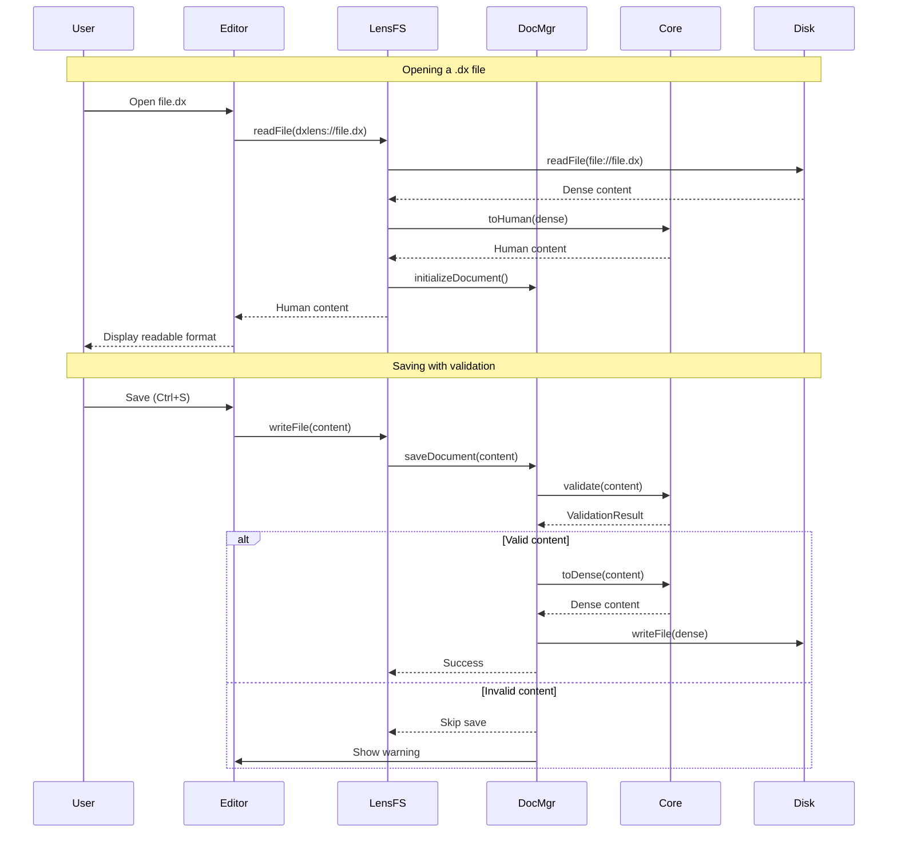

# Design Document: DX Serializer VS Code Extension

## Overview

The DX Serializer VS Code Extension provides a seamless editing experience for `.dx` files by implementing a virtual file system that transforms between dense (disk) and human-readable (editor) formats. The architecture uses a Rust/WASM core for high-performance transformations with a TypeScript fallback, ensuring reliability across all environments.

The extension intercepts `.dx` file operations through VS Code's FileSystemProvider API, presenting human-readable content to users while maintaining token-efficient storage on disk. This dual-format approach benefits both human developers (readable code) and LLMs (minimal tokens).

## Architecture

```mermaid
graph TB
    subgraph "VS Code"
        Editor[Text Editor]
        FSWatcher[File System Watcher]
        Commands[Command Palette]
        StatusBar[Status Bar]
    end
    
    subgraph "Extension"
        Extension[extension.ts<br/>Entry Point]
        LensFS[DxLensFileSystem<br/>Virtual FS Provider]
        DocMgr[DxDocumentManager<br/>State & Validation]
        Core[DxCore<br/>WASM Wrapper]
        Utils[utils.ts<br/>Helpers]
    end
    
    subgraph "WASM Core"
        WASM[dx_serializer.wasm]
        Fallback[TypeScript Fallback]
    end
    
    subgraph "Disk"
        DXFile[.dx Files<br/>Dense Format]
    end
    
    Editor -->|read/write| LensFS
    LensFS -->|transform| Core
    LensFS -->|state| DocMgr
    Core -->|primary| WASM
    Core -->|fallback| Fallback
    FSWatcher -->|changes| DocMgr
    DocMgr -->|diagnostics| Editor
    Commands -->|actions| Extension
    Extension -->|status| StatusBar
    LensFS -->|read/write| DXFile
```

### Data Flow



## Components and Interfaces

### 1. Extension Entry Point (`extension.ts`)

The main activation point that initializes all components and registers VS Code integrations.

```typescript
interface ExtensionContext {
    dxCore: DxCore;
    documentManager: DxDocumentManager;
    lensFileSystem: DxLensFileSystem;
}

// Activation flow:
// 1. Load WASM core (with fallback)
// 2. Initialize DocumentManager
// 3. Register FileSystemProvider for 'dxlens' scheme
// 4. Set up file watcher for external changes
// 5. Register commands
// 6. Create status bar item
```

### 2. DxCore Interface (`dxCore.ts`)

Abstraction over the WASM/fallback transformation engine.

```typescript
interface TransformResult {
    success: boolean;
    content: string;
    error?: string;
}

interface ValidationResult {
    success: boolean;
    error?: string;
    line?: number;
    column?: number;
    hint?: string;
}

interface DxCore {
    /** Transform dense format to human-readable format */
    toHuman(dense: string): TransformResult;
    
    /** Transform human-readable format to dense format */
    toDense(human: string): TransformResult;
    
    /** Validate content syntax */
    validate(content: string): ValidationResult;
    
    /** Check if content is complete enough to save */
    isSaveable(content: string): boolean;
}
```

### 3. DxDocumentManager (`dxDocumentManager.ts`)

Manages document state, validation, and save coordination.

```typescript
interface DocumentState {
    /** Dense content currently on disk */
    diskDense: string;
    
    /** Last successfully saved dense content */
    lastValidDense: string;
    
    /** Current human content in editor */
    currentHuman: string;
    
    /** Whether content is syntactically valid */
    isValid: boolean;
    
    /** Last validation error */
    lastError: string | null;
    
    /** Timestamp of last keystroke */
    lastKeystroke: number;
    
    /** Pending save timeout */
    saveTimeout: NodeJS.Timeout | null;
    
    /** Whether a save is in progress */
    isSaving: boolean;
}

interface DxDocumentManager {
    /** Initialize document when first opened */
    initializeDocument(uri: Uri): Promise<string>;
    
    /** Save document with validation gating */
    saveDocument(uri: Uri, content: Uint8Array): Promise<void>;
    
    /** Force save without validation */
    forceSave(uri: Uri): Promise<void>;
    
    /** Handle external file changes */
    handleExternalChange(uri: Uri): Promise<void>;
    
    /** Force refresh from disk */
    forceRefresh(uri: Uri): Promise<void>;
    
    /** Get current document state */
    getState(uri: Uri): DocumentState | undefined;
    
    /** Check if extension is currently writing to a file */
    isWriting(uri: Uri): boolean;
}
```

### 4. DxLensFileSystem (`dxLensFileSystem.ts`)

Virtual file system provider that intercepts `.dx` file operations.

```typescript
interface DxLensFileSystem extends FileSystemProvider {
    /** Read file and transform to human format */
    readFile(uri: Uri): Promise<Uint8Array>;
    
    /** Transform to dense and write to disk */
    writeFile(uri: Uri, content: Uint8Array, options: WriteOptions): Promise<void>;
    
    /** Get file stats (using human content size) */
    stat(uri: Uri): Promise<FileStat>;
    
    /** Watch for file changes */
    watch(uri: Uri): Disposable;
}
```

### 5. Utility Functions (`utils.ts`)

Helper functions for URI manipulation and file type detection.

```typescript
/** Check if URI is exactly a .dx file (not .dx.json, etc.) */
function isExactlyDxFile(uri: Uri): boolean;

/** Convert lens URI (dxlens://) to disk URI (file://) */
function getDiskUri(uri: Uri): Uri;

/** Convert disk URI to lens URI */
function getLensUri(uri: Uri): Uri;

/** Debounce function for save operations */
function debounce<T>(fn: T, delay: number): T;
```

## Data Models

### Configuration Schema

```typescript
interface DxConfiguration {
    /** Validate syntax before saving (default: true) */
    validateBeforeSave: boolean;
    
    /** Grace period in ms after last keystroke (default: 2000) */
    autoSaveGracePeriod: number;
    
    /** Indent size: 2 or 4 spaces (default: 2) */
    indentSize: 2 | 4;
    
    /** Show dense preview on hover (default: false) */
    showDensePreview: boolean;
}
```

### WASM Serializer Configuration

```rust
pub struct SerializerConfig {
    /// Indentation string (default: "  " - 2 spaces)
    pub indent: String,
    
    /// Whether to preserve comments in human format
    pub preserve_comments: bool,
    
    /// Whether to use smart quoting for special characters
    pub smart_quoting: bool,
    
    /// Maximum line length before wrapping (0 = no limit)
    pub max_line_length: usize,
}
```

### File Change Event

```typescript
interface DxFileChangeEvent {
    type: 'created' | 'changed' | 'deleted';
    uri: Uri;
    isExternal: boolean;
}
```

### Diagnostic Information

```typescript
interface DxDiagnostic {
    range: Range;
    message: string;
    severity: DiagnosticSeverity;
    source: 'DX Serializer';
    hint?: string;
}
```


## Correctness Properties

*A property is a characteristic or behavior that should hold true across all valid executions of a system—essentially, a formal statement about what the system should do. Properties serve as the bridge between human-readable specifications and machine-verifiable correctness guarantees.*

Based on the acceptance criteria analysis, the following correctness properties must be validated through property-based testing:

### Property 1: Round-Trip Transformation Consistency

*For any* valid DX content in dense format, transforming to human format and back to dense format SHALL produce content equivalent to the original.

This is the fundamental correctness property for the serializer. It ensures that no data is lost or corrupted during the transformation cycle that occurs when users open and save files.

**Validates: Requirements 1.1, 1.2, 1.6**

### Property 2: Human Format Structure

*For any* valid DX content, the human format output SHALL:
- Contain proper indentation (each nested level indented by the configured indent size)
- Have colons followed by a space for key-value pairs
- Have newlines after opening brackets and commas

*For any* valid DX content, the dense format output SHALL:
- Contain no whitespace outside of string literals
- Contain no comments

**Validates: Requirements 1.3, 1.4, 1.5**

### Property 3: String Value Preservation

*For any* string value (including URLs with query parameters, strings with apostrophes, strings with both quote types, and strings with escape sequences), transforming through the serializer SHALL preserve the exact string content.

This property ensures that:
- Long URLs are never truncated
- Special characters are properly quoted
- Escape sequences survive transformation
- No character data is lost

**Validates: Requirements 2.1, 2.2, 2.3, 2.4, 2.5**

### Property 4: Smart Quoting Correctness

*For any* string containing an apostrophe (single quote), the human format output SHALL wrap the string in double quotes.

*For any* string containing both single and double quotes, the output SHALL use double quote delimiters with escaped internal double quotes.

**Validates: Requirements 2.3, 2.4**

### Property 5: Validation Error Quality

*For any* invalid DX content with:
- Unclosed brackets: the validation result SHALL include the line and column of the opening bracket
- Unclosed strings: the validation result SHALL include the line and column where the string started
- Mismatched brackets: the validation result SHALL include a hint about which bracket was expected

*For all* validation errors, the result SHALL include an actionable hint.

**Validates: Requirements 4.1, 4.2, 4.3, 4.4, 4.5**

### Property 6: File Type Filtering Correctness

*For any* file path:
- Paths ending exactly with `.dx` SHALL be identified as DX files
- Paths with compound extensions (`.dx.json`, `.dx.yml`, `.dx.bak`, etc.) SHALL NOT be identified as DX files
- Paths with non-file schemes SHALL NOT be identified as DX files

**Validates: Requirements 5.1, 5.2, 5.3**

### Property 7: WASM and Fallback Equivalence

*For any* valid DX content, the WASM implementation and TypeScript fallback implementation SHALL produce identical transformation results.

This ensures that users get consistent behavior regardless of whether WASM loads successfully.

**Validates: Requirements 12.3**

## Error Handling

### Transformation Errors

| Error Type | Handling Strategy |
|------------|-------------------|
| Unclosed string | Return error with start position, preserve original content |
| Unclosed bracket | Return error with bracket position, preserve original content |
| Mismatched brackets | Return error with both positions, preserve original content |
| Invalid escape sequence | Preserve as-is, log warning |
| WASM load failure | Fall back to TypeScript implementation |

### Save Errors

| Error Type | Handling Strategy |
|------------|-------------------|
| Validation failure | Skip save, show status bar warning, preserve last valid content |
| Grace period active | Skip save silently, will retry after grace period |
| Disk write failure | Show error message, preserve editor content |
| Transform failure | Show error message, preserve original content |

### File System Errors

| Error Type | Handling Strategy |
|------------|-------------------|
| File not found | Throw FileNotFound error to VS Code |
| Permission denied | Show error message to user |
| External change during save | Detect via file watcher, prompt user |

## Testing Strategy

### Dual Testing Approach

The extension uses both unit tests and property-based tests for comprehensive coverage:

- **Unit tests**: Verify specific examples, edge cases, and VS Code integration points
- **Property tests**: Verify universal properties across randomly generated inputs

### Property-Based Testing Configuration

- **Library**: fast-check (TypeScript) for extension tests, proptest (Rust) for WASM core
- **Iterations**: Minimum 100 iterations per property test
- **Tag format**: `Feature: dx-serializer-extension, Property {number}: {property_text}`

### Test Categories

#### 1. Core Transformation Tests (Property-Based)

```typescript
// Property 1: Round-trip consistency
// Feature: dx-serializer-extension, Property 1: Round-trip transformation
fc.assert(fc.property(
    arbitraryValidDxContent(),
    (content) => {
        const human = core.toHuman(content);
        const dense = core.toDense(human.content);
        return dense.content === content;
    }
), { numRuns: 100 });
```

#### 2. String Preservation Tests (Property-Based)

```typescript
// Property 3: String value preservation
// Feature: dx-serializer-extension, Property 3: String preservation
fc.assert(fc.property(
    arbitraryStringValue(), // URLs, special chars, escapes
    (value) => {
        const dx = `{"key":"${escapeForDx(value)}"}`;
        const human = core.toHuman(dx);
        const dense = core.toDense(human.content);
        return extractValue(dense.content) === value;
    }
), { numRuns: 100 });
```

#### 3. Validation Tests (Property-Based)

```typescript
// Property 5: Validation error quality
// Feature: dx-serializer-extension, Property 5: Validation errors
fc.assert(fc.property(
    arbitraryInvalidDxContent(),
    (content) => {
        const result = core.validate(content);
        return !result.success && 
               result.line !== undefined && 
               result.hint !== undefined;
    }
), { numRuns: 100 });
```

#### 4. File Filtering Tests (Property-Based)

```typescript
// Property 6: File type filtering
// Feature: dx-serializer-extension, Property 6: File filtering
fc.assert(fc.property(
    arbitraryFilePath(),
    (path) => {
        const isDx = isExactlyDxFile(path);
        const shouldBeDx = path.endsWith('.dx') && 
                          !hasCompoundExtension(path);
        return isDx === shouldBeDx;
    }
), { numRuns: 100 });
```

#### 5. Unit Tests (Specific Examples)

- Opening a `.dx` file displays human format
- Saving transforms to dense format
- Auto-save respects grace period
- External changes update editor
- Commands execute correctly
- Status bar shows correct state
- Configuration changes apply

### Test File Organization

```
test/
├── suite/
│   ├── extension.test.ts      # VS Code integration tests
│   ├── roundtrip.test.ts      # Property: round-trip (Property 1)
│   ├── strings.test.ts        # Property: string preservation (Property 3)
│   ├── validation.test.ts     # Property: validation errors (Property 5)
│   ├── fileFilter.test.ts     # Property: file filtering (Property 6)
│   └── equivalence.test.ts    # Property: WASM/fallback (Property 7)
└── generators/
    ├── dxContent.ts           # Arbitrary DX content generators
    ├── strings.ts             # Arbitrary string generators
    └── paths.ts               # Arbitrary file path generators
```

### WASM Core Tests (Rust)

```rust
// In crates/serializer/src/wasm.rs
#[cfg(test)]
mod tests {
    use proptest::prelude::*;
    
    // Property 1: Round-trip
    proptest! {
        #[test]
        fn round_trip_preserves_content(content in valid_dx_content()) {
            let serializer = DxSerializer::new();
            let human = serializer.to_human(&content);
            let dense = serializer.to_dense(&human.content);
            prop_assert_eq!(content, dense.content);
        }
    }
    
    // Property 3: String preservation
    proptest! {
        #[test]
        fn strings_preserved(value in any_string_value()) {
            let dx = format!(r#"{{"key":"{}"}}"#, escape(&value));
            let serializer = DxSerializer::new();
            let human = serializer.to_human(&dx);
            let dense = serializer.to_dense(&human.content);
            prop_assert!(dense.content.contains(&escape(&value)));
        }
    }
}
```
