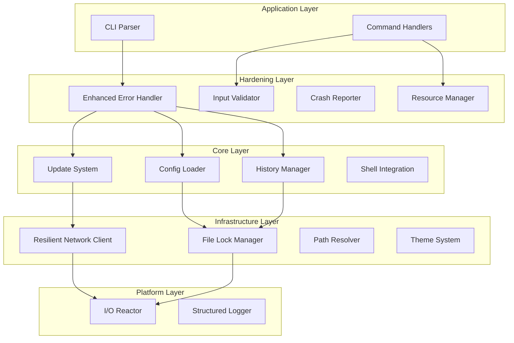

# Design Document: DX CLI Hardening

## Overview

This design document specifies the hardening improvements for the DX CLI to transform it from a functional prototype into a professional, battle-tested CLI tool. The improvements are organized into cross-cutting concerns that enhance existing modules with robustness, reliability, and graceful error handling.

The design follows a layered approach where hardening components wrap or enhance existing functionality without requiring major architectural changes.

## Architecture



## Components and Interfaces

### 1. Enhanced Error Handler (`src/utils/error.rs`)

```rust
/// Enhanced error with retry support and detailed context
#[derive(Debug)]
pub struct EnhancedError {
    pub error: DxError,
    pub context: ErrorContext,
    pub retry_count: u32,
    pub max_retries: u32,
}

#[derive(Debug, Clone)]
pub struct ErrorContext {
    pub operation: String,
    pub file_path: Option<PathBuf>,
    pub line_number: Option<usize>,
    pub column: Option<usize>,
    pub snippet: Option<String>,
    pub retry_delays: Vec<Duration>,
}

impl EnhancedError {
    /// Get a user-friendly error message with full context
    pub fn display_message(&self) -> String;
    
    /// Get actionable hint for resolving the error
    pub fn hint(&self) -> Option<String>;
    
    /// Check if error should be retried
    pub fn should_retry(&self) -> bool {
        self.error.is_retryable() && self.retry_count < self.max_retries
    }
    
    /// Get the next retry delay using exponential backoff
    pub fn next_retry_delay(&self) -> Duration {
        Duration::from_secs(1 << self.retry_count) // 1s, 2s, 4s
    }
}

/// Retry wrapper with exponential backoff
pub async fn with_retry<T, F, Fut>(
    operation: &str,
    max_retries: u32,
    f: F,
) -> Result<T, EnhancedError>
where
    F: Fn() -> Fut,
    Fut: Future<Output = Result<T, DxError>>;
```

### 2. Input Validator (`src/utils/input.rs`)

```rust
/// Input validation and sanitization
pub struct InputValidator;

#[derive(Debug, Clone)]
pub struct ValidationError {
    pub field: String,
    pub value: String,
    pub expected: String,
    pub suggestion: Option<String>,
}

impl InputValidator {
    /// Validate port number (1-65535)
    pub fn validate_port(port: u16) -> Result<u16, ValidationError>;
    
    /// Validate semantic version string (X.Y.Z)
    pub fn validate_version(version: &str) -> Result<(u32, u32, u32), ValidationError>;
    
    /// Sanitize string for shell usage - escape metacharacters
    pub fn sanitize_for_shell(input: &str) -> String;
    
    /// Check for path traversal attempts (../ or symlinks outside project)
    pub fn check_path_traversal(path: &Path, project_root: &Path) -> Result<(), SecurityWarning>;
    
    /// Validate and sanitize environment variable value
    pub fn validate_env_var(name: &str, value: &str) -> Result<String, ValidationError>;
}

/// Shell metacharacters that must be escaped
const SHELL_METACHARACTERS: &[char] = &[';', '|', '&', '$', '`', '(', ')', '{', '}', '[', ']', '<', '>', '!', '*', '?', '~', '#', '"', '\'', '\\', '\n'];
```

### 3. Resilient Network Client (`src/utils/network.rs`)

```rust
/// Resilient HTTP client with retry and proxy support
pub struct NetworkClient {
    timeout: Duration,
    max_retries: u32,
    proxy_config: ProxyConfig,
}

#[derive(Debug, Clone, Default)]
pub struct ProxyConfig {
    pub http_proxy: Option<String>,
    pub https_proxy: Option<String>,
    pub no_proxy: Vec<String>,
}

impl ProxyConfig {
    /// Load proxy configuration from environment variables
    pub fn from_env() -> Self {
        Self {
            http_proxy: std::env::var("HTTP_PROXY").ok()
                .or_else(|| std::env::var("http_proxy").ok()),
            https_proxy: std::env::var("HTTPS_PROXY").ok()
                .or_else(|| std::env::var("https_proxy").ok()),
            no_proxy: std::env::var("NO_PROXY")
                .or_else(|_| std::env::var("no_proxy"))
                .map(|s| s.split(',').map(|s| s.trim().to_string()).collect())
                .unwrap_or_default(),
        }
    }
    
    /// Check if proxy should be used for a given URL
    pub fn should_proxy(&self, url: &str) -> bool;
}

impl NetworkClient {
    /// Create client respecting environment proxy settings
    pub fn from_env() -> Self;
    
    /// GET with automatic retry and exponential backoff
    pub async fn get(&self, url: &str) -> Result<Response, EnhancedError>;
    
    /// Download with resume support for large files (>1MB)
    pub async fn download_resumable(
        &self,
        url: &str,
        dest: &Path,
        progress: impl Fn(u64, u64),
    ) -> Result<(), EnhancedError>;
    
    /// Check if we're in offline mode (no network available)
    pub fn is_offline(&self) -> bool;
}
```

### 4. File Lock Manager (`src/utils/lock.rs`)

```rust
/// Cross-platform file locking for concurrent access
pub struct FileLock {
    path: PathBuf,
    lock_file: std::fs::File,
    lock_type: LockType,
}

#[derive(Debug, Clone, Copy)]
pub enum LockType {
    Shared,    // Multiple readers
    Exclusive, // Single writer
}

impl FileLock {
    /// Acquire lock with blocking wait and timeout
    pub fn acquire(path: &Path, lock_type: LockType, timeout: Duration) -> Result<Self, DxError>;
    
    /// Try to acquire lock without blocking
    pub fn try_acquire(path: &Path, lock_type: LockType) -> Result<Option<Self>, DxError>;
    
    /// Release lock explicitly (also called on drop)
    pub fn release(self) -> Result<(), DxError>;
    
    /// Get the lock file path (.lock suffix)
    fn lock_path(path: &Path) -> PathBuf {
        path.with_extension(format!("{}.lock", 
            path.extension().map(|e| e.to_string_lossy()).unwrap_or_default()))
    }
}

impl Drop for FileLock {
    fn drop(&mut self) {
        // Ensure lock is released even on panic
        let _ = self.release_internal();
    }
}
```

### 5. Resource Manager (`src/utils/resources.rs`)

```rust
/// Manages system resources and cleanup
pub struct ResourceManager {
    temp_files: Arc<Mutex<Vec<PathBuf>>>,
    child_processes: Arc<Mutex<Vec<Child>>>,
    max_concurrent_processes: usize,
    process_semaphore: Arc<Semaphore>,
}

impl ResourceManager {
    /// Create with default limits (4 concurrent processes)
    pub fn new() -> Self;
    
    /// Create with custom limits
    pub fn with_limits(max_processes: usize) -> Self;
    
    /// Register temp file for cleanup on exit/panic
    pub fn register_temp_file(&self, path: PathBuf);
    
    /// Create a temp file that's automatically registered
    pub fn create_temp_file(&self, prefix: &str) -> Result<PathBuf, DxError>;
    
    /// Spawn process with limit enforcement
    pub async fn spawn_limited(&self, cmd: &str, args: &[&str]) -> Result<Child, DxError>;
    
    /// Clean up all registered resources
    pub fn cleanup(&self);
    
    /// Check available disk space
    pub fn check_disk_space(&self, path: &Path, required: u64) -> Result<(), DxError>;
    
    /// Terminate all child processes gracefully
    pub async fn terminate_children(&self, timeout: Duration);
}

impl Drop for ResourceManager {
    fn drop(&mut self) {
        self.cleanup();
    }
}

/// Global resource manager instance
static RESOURCE_MANAGER: OnceCell<ResourceManager> = OnceCell::new();

pub fn resource_manager() -> &'static ResourceManager {
    RESOURCE_MANAGER.get_or_init(ResourceManager::new)
}
```

### 6. Crash Reporter (`src/utils/crash.rs`)

```rust
/// Panic handler and crash report generator
pub struct CrashReporter;

#[derive(Debug, Serialize)]
pub struct CrashReport {
    pub id: String,
    pub timestamp: DateTime<Utc>,
    pub version: String,
    pub os: String,
    pub arch: String,
    pub panic_message: String,
    pub panic_location: Option<String>,
    pub backtrace: String,
    pub command_line: Vec<String>,
    pub environment: HashMap<String, String>,
    pub recent_commands: Vec<String>,
}

impl CrashReporter {
    /// Install panic hook - call once at startup
    pub fn install();
    
    /// Generate crash report from panic info
    fn generate_report(panic_info: &PanicInfo) -> CrashReport;
    
    /// Save crash report to ~/.dx/crash-reports/
    fn save_report(report: &CrashReport) -> Result<PathBuf, std::io::Error>;
    
    /// Display user-friendly crash message
    fn display_crash_message(report_path: &Path);
}
```

### 7. Enhanced Path Resolver (`src/utils/paths.rs`)

```rust
/// Enhanced path resolution with Unicode and security support
pub struct PathResolver {
    home_dir: PathBuf,
    project_root: Option<PathBuf>,
}

impl PathResolver {
    /// Create resolver with detected home directory
    pub fn new() -> Self;
    
    /// Create resolver with specific project root
    pub fn with_project_root(project_root: PathBuf) -> Self;
    
    /// Resolve path with full normalization
    /// - Expands ~ to home directory
    /// - Normalizes separators to platform-native
    /// - Handles Unicode characters correctly
    /// - Adds \\?\ prefix for long Windows paths (>260 chars)
    pub fn resolve(&self, path: &str) -> Result<PathBuf, DxError>;
    
    /// Resolve symlinks with depth limit (max 40)
    pub fn resolve_symlinks(&self, path: &Path) -> Result<PathBuf, DxError>;
    
    /// Check if path is within project directory (handles symlinks)
    pub fn is_within_project(&self, path: &Path) -> Result<bool, DxError>;
    
    /// Escape path for shell usage
    pub fn escape_for_shell(&self, path: &Path) -> String;
    
    /// Get fallback directory when home is not writable
    pub fn fallback_dir() -> PathBuf {
        std::env::current_dir()
            .unwrap_or_else(|_| PathBuf::from("."))
            .join(".dx")
    }
}
```

### 8. Structured Logger (`src/utils/logger.rs`)

```rust
/// Structured logging with rotation and CI support
pub struct StructuredLogger {
    level: LogLevel,
    output: LogOutput,
    ci_mode: bool,
    log_file: Option<PathBuf>,
}

#[derive(Debug, Clone, Copy)]
pub enum LogLevel {
    Error,
    Warn,
    Info,
    Debug,
    Trace,
}

#[derive(Debug, Clone)]
pub enum LogOutput {
    Stderr,
    File(PathBuf),
    Both(PathBuf),
}

impl StructuredLogger {
    /// Create logger based on flags and environment
    pub fn new(verbose: bool, quiet: bool, debug: bool) -> Self;
    
    /// Log with timing information
    pub fn log_timed(&self, level: LogLevel, operation: &str, duration: Duration, message: &str);
    
    /// Log in CI-friendly JSON format
    pub fn log_ci(&self, level: LogLevel, message: &str, context: &HashMap<String, String>);
    
    /// Rotate log file if it exceeds 10MB
    pub fn rotate_if_needed(&self) -> Result<(), DxError>;
    
    /// Get log directory (~/.dx/logs/)
    pub fn log_dir() -> PathBuf;
}
```

## Data Models

### Enhanced History Entry

```rust
#[derive(Debug, Clone, Serialize, Deserialize)]
pub struct HistoryEntry {
    pub id: String,
    pub command: String,
    pub arguments: Vec<String>,
    pub exit_code: i32,
    pub duration_ms: u64,
    pub timestamp: DateTime<Utc>,
    pub working_dir: PathBuf,
}
```

### Crash Report

```rust
#[derive(Debug, Serialize, Deserialize)]
pub struct CrashReport {
    pub id: String,
    pub timestamp: DateTime<Utc>,
    pub version: String,
    pub os: String,
    pub arch: String,
    pub panic_message: String,
    pub panic_location: Option<String>,
    pub backtrace: String,
    pub command_line: Vec<String>,
    pub environment: HashMap<String, String>,
    pub recent_commands: Vec<String>,
}
```

### Validation Error

```rust
#[derive(Debug, Clone)]
pub struct ValidationError {
    pub field: String,
    pub value: String,
    pub expected: String,
    pub suggestion: Option<String>,
}

impl std::fmt::Display for ValidationError {
    fn fmt(&self, f: &mut std::fmt::Formatter<'_>) -> std::fmt::Result {
        write!(f, "Invalid {}: '{}' (expected {})", self.field, self.value, self.expected)?;
        if let Some(ref suggestion) = self.suggestion {
            write!(f, "\n  hint: {}", suggestion)?;
        }
        Ok(())
    }
}
```

## Correctness Properties

*A property is a characteristic or behavior that should hold true across all valid executions of a system—essentially, a formal statement about what the system should do. Properties serve as the bridge between human-readable specifications and machine-verifiable correctness guarantees.*

### Property 1: Retry with Exponential Backoff

*For any* network operation that fails with a retryable error (Network, Timeout, TLS), the retry mechanism SHALL attempt up to 3 retries with delays following the pattern 2^n seconds (1s, 2s, 4s).

**Validates: Requirements 1.1, 3.1**

### Property 2: Error Retryability Classification

*For any* DxError, is_retryable() SHALL return true only for Network, Timeout, and TLS error types, and false for all other error types.

**Validates: Requirements 1.7**

### Property 3: Error Hints Completeness

*For any* DxError that has a defined hint (ConfigNotFound, PermissionDenied, ToolNotInstalled, TLS, DNS errors), the hint() method SHALL return a non-empty string with actionable guidance.

**Validates: Requirements 1.3, 3.4, 3.6, 11.5**

### Property 4: Config Error Location Reporting

*For any* malformed configuration file, the ConfigInvalid error SHALL include the file path, a line number greater than 0, and a non-empty error message.

**Validates: Requirements 1.4**

### Property 5: Path Separator Normalization

*For any* path string containing mixed separators (/ and \), resolve_path() SHALL produce a PathBuf containing only the platform-native separator (\ on Windows, / on Unix).

**Validates: Requirements 2.1**

### Property 6: Home Directory Expansion

*For any* path string starting with "~/", resolve_path() SHALL replace the prefix with the user's home directory, and the result SHALL NOT contain the "~" character.

**Validates: Requirements 2.2**

### Property 7: Long Path Prefix on Windows

*For any* Windows path exceeding 260 characters that doesn't already have the \\?\ prefix, handle_long_path() SHALL add the prefix.

**Validates: Requirements 2.3**

### Property 8: Symlink Resolution Depth Limit

*For any* path with more than 40 levels of symlinks, resolve_symlinks() SHALL return a SymlinkLoop error.

**Validates: Requirements 2.4**

### Property 9: Unicode Path Handling

*For any* path string containing Unicode characters (including emoji, CJK, RTL scripts), resolve_path() SHALL produce a valid PathBuf that preserves all characters.

**Validates: Requirements 2.5**

### Property 10: Proxy Configuration from Environment

*For any* environment where HTTP_PROXY or HTTPS_PROXY is set, ProxyConfig::from_env() SHALL capture those values, and should_proxy() SHALL return true for matching URLs.

**Validates: Requirements 3.5**

### Property 11: Config Field Validation

*For any* configuration with invalid field types (e.g., string where number expected), the Config_Loader SHALL return a ConfigInvalid error with the field name.

**Validates: Requirements 4.1**

### Property 12: Unknown Config Fields Warning

*For any* configuration file containing unknown fields, the Config_Loader SHALL successfully load the known fields and the unknown field names SHALL be available for warning.

**Validates: Requirements 4.3**

### Property 13: Config Merge Precedence

*For any* field defined in both local and global config files, the merged config SHALL use the local value.

**Validates: Requirements 4.5**

### Property 14: Config Backup on Save

*For any* config save operation where the file already exists, a backup file with .bak extension SHALL be created containing the previous content.

**Validates: Requirements 4.7**

### Property 15: Signature Verification Gates Updates

*For any* update with an invalid or missing Ed25519 signature, the Update_System SHALL return a SignatureInvalid error and NOT apply the update.

**Validates: Requirements 5.1, 5.2**

### Property 16: Delta Patch Preference

*For any* UpdateInfo where delta_url is Some, preferred_url() SHALL return the delta URL, and preferred_size() SHALL return the delta size.

**Validates: Requirements 5.5**

### Property 17: Update Version Display

*For any* UpdateInfo, version_display() SHALL contain both current_version and new_version strings.

**Validates: Requirements 5.8**

### Property 18: Shell Integration Duplicate Detection

*For any* shell config file containing the integration marker, is_installed() SHALL return true.

**Validates: Requirements 6.3**

### Property 19: Shell Integration Idempotence

*For any* shell type, installing integration twice with --force SHALL result in exactly one copy of the integration marker in the config file.

**Validates: Requirements 6.7**

### Property 20: Completion Script Validity

*For any* supported shell type, the generated completion script SHALL contain shell-appropriate syntax (e.g., "complete" for bash, "compdef" for zsh).

**Validates: Requirements 6.6**

### Property 21: History Search Case Insensitivity

*For any* search query, the History_Manager SHALL return all entries where the command, arguments, or working directory contain the query string (case-insensitive).

**Validates: Requirements 7.3**

### Property 22: History FIFO Eviction

*For any* history with max_entries = N, after adding M entries where M > N, the history SHALL contain exactly N entries, and those entries SHALL be the M - N + 1 through M most recently added.

**Validates: Requirements 7.4**

### Property 23: History Statistics Accuracy

*For any* history, stats().total SHALL equal stats().successful + stats().failed, and the sum of top_commands counts SHALL NOT exceed total.

**Validates: Requirements 7.6**

### Property 24: History Entry Completeness

*For any* HistoryEntry, all fields (command, arguments, exit_code, duration_ms, timestamp, working_dir) SHALL be present and the command SHALL be non-empty.

**Validates: Requirements 7.7**

### Property 25: Port Validation Range

*For any* port number outside the range 1-65535, validate_port() SHALL return a ValidationError.

**Validates: Requirements 8.4**

### Property 26: Version Validation Format

*For any* version string not matching the pattern X.Y.Z (where X, Y, Z are non-negative integers), validate_version() SHALL return a ValidationError mentioning the expected format.

**Validates: Requirements 8.5**

### Property 27: Shell Metacharacter Escaping

*For any* string containing shell metacharacters (; | & $ ` etc.), sanitize_for_shell() SHALL escape all metacharacters such that the result is safe for shell execution.

**Validates: Requirements 8.3**

### Property 28: Path Traversal Detection

*For any* path containing ".." that resolves outside the project directory, check_path_traversal() SHALL return a SecurityWarning.

**Validates: Requirements 8.2**

### Property 29: Process Limit Enforcement

*For any* sequence of spawn_limited() calls exceeding max_concurrent_processes, the excess calls SHALL block until a slot becomes available.

**Validates: Requirements 9.1**

### Property 30: Event Debouncing

*For any* sequence of file change events within 100ms, the watcher SHALL coalesce them into a single event.

**Validates: Requirements 9.2, 12.6**

### Property 31: Verbose Output Contains Timing

*For any* operation logged with --verbose flag, the output SHALL contain timing information (duration in ms or similar).

**Validates: Requirements 10.1, 10.6**

### Property 32: Quiet Mode Suppresses Non-Errors

*For any* CLI invocation with --quiet flag, the output SHALL contain only error messages (no info, success, or warning messages).

**Validates: Requirements 10.2**

### Property 33: CI Mode JSON Output

*For any* CLI invocation with CI=true environment variable, log output SHALL be valid JSON with level, message, and timestamp fields.

**Validates: Requirements 10.4**

### Property 34: Color-Disabled Output Purity

*For any* output when colors are disabled (NO_COLOR set or non-TTY), the Theme SHALL NOT include any ANSI escape sequences.

**Validates: Requirements 11.2**

### Property 35: Container Detection

*For any* environment with /.dockerenv file or "docker"/"kubepods" in /proc/1/cgroup, is_container() SHALL return true.

**Validates: Requirements 11.6**

### Property 36: Terminal Width Fallback

*For any* environment where terminal width cannot be detected, terminal_width() SHALL return 80.

**Validates: Requirements 11.7**

### Property 37: File Lock Blocking vs Non-Blocking

*For any* file, try_acquire() SHALL return immediately (either Some(lock) or None), while acquire() with timeout SHALL block up to the timeout duration.

**Validates: Requirements 12.7**

### Property 38: Cache Invalidation on Source Change

*For any* cached config where the source file modification time is newer than the cache, loading SHALL reload from source and update the cache.

**Validates: Requirements 12.5**

## Error Handling

### Error Categories and Retry Behavior

| Error Type | Retryable | Max Retries | Backoff Pattern |
|------------|-----------|-------------|-----------------|
| Network | Yes | 3 | Exponential (1s, 2s, 4s) |
| Timeout | Yes | 3 | Exponential (1s, 2s, 4s) |
| TLS | Yes | 2 | Linear (1s, 1s) |
| DNS | Yes | 2 | Linear (1s, 1s) |
| Permission | No | 0 | N/A |
| Config | No | 0 | N/A |
| Signature | No | 0 | N/A |
| Validation | No | 0 | N/A |

### Panic Handling Strategy

1. Install custom panic hook at startup via `CrashReporter::install()`
2. On panic:
   - Generate crash report with system info, backtrace, recent commands
   - Save report to `~/.dx/crash-reports/crash-{timestamp}.json`
   - Clean up resources via ResourceManager
   - Display user-friendly message with report location
   - Exit with code 101

### Signal Handling Strategy

1. Register handlers for SIGINT, SIGTERM (Unix) and Ctrl+C (Windows)
2. On signal:
   - Set global shutdown flag
   - Terminate child processes gracefully (SIGTERM, wait 5s, SIGKILL)
   - Clean up temporary files
   - Release file locks
   - Exit with code 130 (128 + SIGINT)

## Testing Strategy

### Unit Tests

- Test each validator function with valid and invalid inputs
- Test error message formatting and hint generation
- Test path normalization on each platform
- Test config parsing with various malformed inputs
- Test shell metacharacter escaping

### Property-Based Tests

Using `proptest` with minimum 100 iterations per property:

1. **Retry behavior**: Simulate failures, verify retry count and timing
2. **Path normalization**: Generate paths with random characters, verify valid output
3. **Config validation**: Generate configs with random invalid fields, verify error details
4. **History operations**: Generate random command sequences, verify invariants
5. **Input validation**: Generate random inputs, verify validation results
6. **Shell escaping**: Generate strings with metacharacters, verify safe output

### Integration Tests

- Test retry behavior with mock HTTP server
- Test file locking with concurrent processes
- Test crash report generation with induced panics
- Test shell integration install/uninstall cycle
- Test signal handling with child processes

### Platform-Specific Tests

- Windows: Long path handling, IOCP fallback, PowerShell completions
- macOS: kqueue reactor, Zsh completions, Homebrew paths
- Linux: io_uring fallback, Bash completions, container detection
