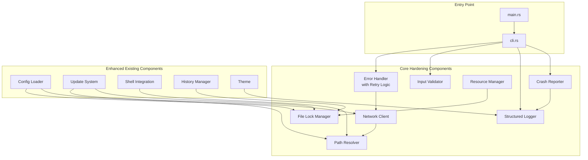

# Design Document: DX CLI Hardening

## Overview

This design document describes the architecture and implementation approach for hardening the DX CLI from a functional prototype into a production-ready, battle-tested tool. The hardening focuses on twelve key areas: error handling with retry logic, cross-platform path handling, network resilience, configuration validation, self-update security, shell integration, command history, input validation, resource management, logging/diagnostics, graceful degradation, and concurrent operation safety.

The implementation enhances existing modules (`error.rs`, `paths.rs`, `history.rs`, `dx_config.rs`) and introduces new components (`input.rs` validator, `network.rs` client, `resource.rs` manager, `crash.rs` reporter, `lock.rs` file locking, `logger.rs` structured logging).

## Architecture



## Components and Interfaces

### 1. Enhanced Error Handler (`src/utils/error.rs`)

Extends the existing `DxError` enum with retry logic and comprehensive error context.

```rust
/// Error context for enhanced reporting
pub struct ErrorContext {
    pub operation: String,
    pub details: Option<String>,
    pub path: Option<PathBuf>,
}

/// Enhanced error with retry information
pub struct EnhancedError {
    pub error: DxError,
    pub retry_count: u32,
    pub max_retries: u32,
    pub context: ErrorContext,
}

impl EnhancedError {
    /// Display user-friendly message with full context
    pub fn display_message(&self) -> String;
    
    /// Check if operation should be retried
    pub fn should_retry(&self) -> bool;
    
    /// Calculate next retry delay (exponential backoff)
    pub fn next_retry_delay(&self) -> Duration;
}

/// Async retry wrapper with exponential backoff
pub async fn with_retry<T, F, Fut>(
    operation_name: &str,
    max_retries: u32,
    operation: F,
) -> Result<T, EnhancedError>;
```

### 2. Input Validator (`src/utils/input.rs`)

New module for comprehensive input validation and sanitization.

```rust
/// Validation error with context
pub struct ValidationError {
    pub field: String,
    pub value: String,
    pub expected: String,
    pub suggestion: Option<String>,
}

/// Security warning for path traversal
pub struct SecurityWarning {
    pub path: PathBuf,
    pub reason: String,
}

pub struct InputValidator;

impl InputValidator {
    /// Validate port number (1-65535)
    pub fn validate_port(port: u32) -> Result<u16, ValidationError>;
    
    /// Validate semver version string
    pub fn validate_version(version: &str) -> Result<(u32, u32, u32), ValidationError>;
    
    /// Sanitize input for shell execution
    pub fn sanitize_for_shell(input: &str) -> String;
    
    /// Check for path traversal attacks
    pub fn check_path_traversal(path: &Path, project_root: &Path) -> Result<(), SecurityWarning>;
}
```

### 3. Path Resolver (`src/utils/paths.rs`)

Enhanced with Unicode support, shell escaping, and project boundary checking.

```rust
/// Resolve path with home expansion and separator normalization
pub fn resolve_path(path: &str) -> PathBuf;

/// Resolve symlinks up to MAX_SYMLINK_DEPTH (40) levels
pub fn resolve_symlinks(path: &Path) -> Result<PathBuf, DxError>;

/// Handle Windows long paths (>260 chars)
pub fn handle_long_path(path: &Path) -> PathBuf;

/// Check if path is within project directory
pub fn is_within_project(path: &Path, project_root: &Path) -> Result<bool, DxError>;

/// Escape path for shell execution
pub fn escape_for_shell(path: &Path) -> String;

/// Get fallback directory when home is not writable
pub fn fallback_dir() -> PathBuf;
```

### 4. File Lock Manager (`src/utils/lock.rs`)

New module for cross-platform file locking.

```rust
pub enum LockType {
    Shared,
    Exclusive,
}

pub struct FileLock {
    path: PathBuf,
    handle: File,
    lock_type: LockType,
}

impl FileLock {
    /// Acquire lock with timeout (blocking)
    pub fn acquire(path: &Path, lock_type: LockType, timeout: Duration) -> Result<Self, DxError>;
    
    /// Try to acquire lock (non-blocking)
    pub fn try_acquire(path: &Path, lock_type: LockType) -> Result<Option<Self>, DxError>;
}

impl Drop for FileLock {
    /// Automatically release lock
    fn drop(&mut self);
}
```

### 5. Network Client (`src/utils/network.rs`)

New module for resilient HTTP operations with proxy support.

```rust
pub struct ProxyConfig {
    pub http_proxy: Option<String>,
    pub https_proxy: Option<String>,
    pub no_proxy: Vec<String>,
}

impl ProxyConfig {
    /// Parse proxy configuration from environment
    pub fn from_env() -> Self;
}

pub struct NetworkClient {
    client: reqwest::Client,
    proxy_config: ProxyConfig,
}

impl NetworkClient {
    /// GET request with automatic retry
    pub async fn get(&self, url: &str) -> Result<Response, EnhancedError>;
    
    /// Download with resume support for files >1MB
    pub async fn download_resumable(&self, url: &str, dest: &Path) -> Result<(), EnhancedError>;
    
    /// Check if network is available
    pub fn is_offline() -> bool;
}
```

### 6. Resource Manager (`src/utils/resource.rs`)

New module for system resource management.

```rust
pub struct ResourceManager {
    temp_files: Arc<Mutex<Vec<PathBuf>>>,
    child_processes: Arc<Mutex<Vec<Child>>>,
    process_semaphore: Arc<Semaphore>,
}

impl ResourceManager {
    /// Create with process limit (default: 4)
    pub fn new(max_processes: usize) -> Self;
    
    /// Register temp file for cleanup
    pub fn register_temp_file(&self, path: PathBuf);
    
    /// Create and register temp file
    pub fn create_temp_file(&self, prefix: &str) -> Result<PathBuf, DxError>;
    
    /// Spawn process with limit enforcement
    pub async fn spawn_limited(&self, cmd: &mut Command) -> Result<Child, DxError>;
    
    /// Check available disk space
    pub fn check_disk_space(path: &Path) -> Result<u64, DxError>;
    
    /// Clean up all resources
    pub fn cleanup(&self);
    
    /// Terminate children gracefully (SIGTERM, then SIGKILL after 5s)
    pub async fn terminate_children(&self);
}
```

### 7. Crash Reporter (`src/utils/crash.rs`)

New module for panic handling and crash reports.

```rust
#[derive(Serialize)]
pub struct CrashReport {
    pub id: String,
    pub timestamp: DateTime<Utc>,
    pub version: String,
    pub os: String,
    pub arch: String,
    pub panic_message: String,
    pub panic_location: Option<String>,
    pub backtrace: String,
    pub recent_commands: Vec<String>,
    pub system_info: SystemInfo,
}

pub struct CrashReporter;

impl CrashReporter {
    /// Install panic hook
    pub fn install(resource_manager: Arc<ResourceManager>);
    
    /// Generate crash report from panic info
    fn generate_report(panic_info: &PanicInfo) -> CrashReport;
    
    /// Save report to ~/.dx/crash-reports/
    fn save_report(report: &CrashReport) -> Result<PathBuf, DxError>;
    
    /// Display user-friendly crash message
    fn display_crash_message(report_path: &Path);
}
```

### 8. Structured Logger (`src/ui/logger.rs`)

Enhanced logging with verbose/quiet/debug modes and CI support.

```rust
pub enum LogLevel {
    Debug,
    Info,
    Warn,
    Error,
}

pub struct StructuredLogger {
    verbose: bool,
    quiet: bool,
    debug: bool,
    ci_mode: bool,
    file_output: Option<File>,
}

impl StructuredLogger {
    /// Log with timing information (verbose mode)
    pub fn log_timed(&self, level: LogLevel, message: &str, duration: Duration);
    
    /// Log structured JSON (CI mode)
    pub fn log_json(&self, level: LogLevel, data: &impl Serialize);
    
    /// Rotate log file if >10MB
    fn rotate_if_needed(&mut self) -> Result<(), DxError>;
}
```

### 9. Enhanced Config Loader (`src/config/dx_config.rs`)

Extended with validation, merging, and atomic saves.

```rust
impl DxConfig {
    /// Load with field validation
    pub fn load_validated(path: &Path) -> Result<Self, DxError>;
    
    /// Load and merge global + local configs
    pub fn load_merged() -> Result<Self, DxError>;
    
    /// Save atomically with backup
    pub fn save_atomic(&self, path: &Path) -> Result<(), DxError>;
    
    /// Detect unknown fields and warn
    fn check_unknown_fields(content: &str) -> Vec<String>;
}
```

### 10. Event Debouncer (`src/utils/debounce.rs`)

New module for coalescing rapid events.

```rust
pub struct Debouncer<T> {
    window: Duration,
    pending: Arc<Mutex<HashMap<String, T>>>,
}

impl<T: Clone> Debouncer<T> {
    /// Create with debounce window (default: 100ms)
    pub fn new(window: Duration) -> Self;
    
    /// Add event, returns true if new event (not coalesced)
    pub fn add(&self, key: &str, event: T) -> bool;
    
    /// Flush all pending events
    pub fn flush(&self) -> Vec<T>;
}
```

## Data Models

### Error Classification

```rust
impl DxError {
    /// Retryable errors: Network, Timeout, Tls
    /// Non-retryable: all others
    pub fn is_retryable(&self) -> bool {
        matches!(self, 
            DxError::Network { .. } | 
            DxError::Timeout { .. } | 
            DxError::Tls { .. }
        )
    }
}
```

### History Entry (Enhanced)

```rust
#[derive(Serialize, Deserialize)]
pub struct HistoryEntry {
    pub command: String,
    pub arguments: Vec<String>,
    pub exit_code: i32,
    pub duration_ms: u64,
    pub timestamp: DateTime<Utc>,
    pub working_dir: PathBuf,
}
```

### Crash Report

```rust
#[derive(Serialize)]
pub struct CrashReport {
    pub id: String,           // UUID
    pub timestamp: DateTime<Utc>,
    pub version: String,      // CLI version
    pub os: String,           // e.g., "linux", "windows", "macos"
    pub arch: String,         // e.g., "x86_64", "aarch64"
    pub panic_message: String,
    pub panic_location: Option<String>,
    pub backtrace: String,
    pub recent_commands: Vec<String>,
    pub system_info: SystemInfo,
}

#[derive(Serialize)]
pub struct SystemInfo {
    pub memory_total: u64,
    pub memory_available: u64,
    pub cpu_count: usize,
}
```

## Correctness Properties

*A property is a characteristic or behavior that should hold true across all valid executions of a system—essentially, a formal statement about what the system should do. Properties serve as the bridge between human-readable specifications and machine-verifiable correctness guarantees.*


### Property 1: Retry with Exponential Backoff

*For any* retry count n (0 ≤ n < max_retries), the delay before the next retry SHALL be exactly 2^n seconds (base 1 second). Delays SHALL strictly increase with each retry attempt.

**Validates: Requirements 1.1, 3.1**

### Property 2: Error Retryability Classification

*For any* `DxError` of type `Network`, `Timeout`, or `Tls`, `is_retryable()` SHALL return `true`. *For all* other error types, `is_retryable()` SHALL return `false`.

**Validates: Requirements 1.7**

### Property 3: Error Hints Completeness

*For any* `DxError` of type `PermissionDenied`, `Tls`, `Network` (with DNS-related message), or `ToolNotInstalled`, the `hint()` method SHALL return `Some(hint)` where `hint` is a non-empty string containing actionable guidance.

**Validates: Requirements 1.3, 3.4, 3.6, 11.5**

### Property 4: Config Error Location Reporting

*For any* malformed TOML configuration file, the resulting `ConfigInvalid` error SHALL contain a positive line number and a non-empty error message describing the syntax issue.

**Validates: Requirements 1.4**

### Property 5: Path Separator Normalization

*For any* path string containing mixed separators (both `/` and `\`), `resolve_path()` SHALL produce a `PathBuf` containing only the platform-native separator (backslash on Windows, forward slash on Unix).

**Validates: Requirements 2.1**

### Property 6: Home Directory Expansion

*For any* path string starting with `~/`, `resolve_path()` SHALL replace the `~` prefix with the user's home directory. The resulting path SHALL NOT contain the `~` character.

**Validates: Requirements 2.2**

### Property 7: Long Path Prefix on Windows

*For any* Windows path exceeding 200 characters that does not already start with `\\?\`, `handle_long_path()` SHALL prepend the `\\?\` prefix. Paths already prefixed or under 200 characters SHALL remain unchanged.

**Validates: Requirements 2.3**

### Property 8: Symlink Resolution Depth Limit

*For any* path requiring more than 40 levels of symlink resolution, `resolve_symlinks()` SHALL return a `SymlinkLoop` error. *For any* path requiring 40 or fewer levels, it SHALL successfully resolve to the final target.

**Validates: Requirements 2.4**

### Property 9: Unicode Path Handling

*For any* path string containing Unicode characters (emoji, CJK, RTL scripts, combining characters), `resolve_path()` SHALL preserve all Unicode characters in the resulting `PathBuf`.

**Validates: Requirements 2.5**

### Property 10: Proxy Configuration from Environment

*For any* combination of `HTTP_PROXY`, `HTTPS_PROXY`, and `NO_PROXY` environment variables, `ProxyConfig::from_env()` SHALL correctly parse and store all values. Empty or unset variables SHALL result in `None` for the corresponding field.

**Validates: Requirements 3.5**

### Property 11: Config Field Validation

*For any* configuration with a field value outside its valid range (e.g., port > 65535, negative quality), `load_validated()` SHALL return a `ConfigInvalid` error identifying the invalid field.

**Validates: Requirements 4.1**

### Property 12: Unknown Config Fields Warning

*For any* configuration containing fields not defined in the schema, `load_validated()` SHALL successfully load the configuration AND return a list of unknown field names for warning purposes.

**Validates: Requirements 4.3**

### Property 13: Config Merge Precedence

*For any* field defined in both global (`~/.dx/config.toml`) and local (`dx.toml`) configurations, the merged result SHALL contain the local value. Fields only in global SHALL be preserved.

**Validates: Requirements 4.5**

### Property 14: Config Backup on Save

*For any* existing configuration file, calling `save_atomic()` SHALL create a `.bak` backup file containing the previous content before writing the new content.

**Validates: Requirements 4.7**

### Property 15: Signature Verification Gates Updates

*For any* update payload, if the Ed25519 signature verification fails, the update SHALL be aborted and a `SignatureInvalid` error SHALL be returned. Valid signatures SHALL allow the update to proceed.

**Validates: Requirements 5.1, 5.2**

### Property 16: Delta Patch Preference

*For any* update where both delta patch and full download are available, the update system SHALL choose the delta patch. When only full download is available, it SHALL use that.

**Validates: Requirements 5.5**

### Property 17: Update Version Display

*For any* available update, the display output SHALL contain both the current version and the new version, plus a non-empty release notes summary if available.

**Validates: Requirements 5.8**

### Property 18: Shell Integration Duplicate Detection

*For any* shell configuration file already containing DX integration markers, `install()` without `--force` SHALL return a `ShellIntegrationExists` error.

**Validates: Requirements 6.3**

### Property 19: Shell Integration Idempotence

*For any* shell configuration, calling `install(force=true)` multiple times SHALL result in exactly one copy of the DX integration block, with no duplicates.

**Validates: Requirements 6.7**

### Property 20: Completion Script Validity

*For any* supported shell type (Bash, Zsh, Fish, PowerShell, Nushell), the generated completion script SHALL be syntactically valid for that shell.

**Validates: Requirements 6.6**

### Property 21: History Search Case Insensitivity

*For any* search query and history entry, if the entry's command, arguments, or working directory contains the query (case-insensitive), the entry SHALL be included in search results.

**Validates: Requirements 7.3**

### Property 22: History FIFO Eviction

*For any* history with `n` entries where `n > max_entries`, after adding a new entry, the oldest `n - max_entries + 1` entries SHALL be removed, preserving the most recent entries.

**Validates: Requirements 7.4**

### Property 23: History Statistics Accuracy

*For any* history, `stats().total` SHALL equal `stats().successful + stats().failed`, and these counts SHALL match the actual entry counts.

**Validates: Requirements 7.6**

### Property 24: History Entry Completeness

*For any* `HistoryEntry`, all fields (command, arguments, exit_code, duration_ms, timestamp, working_dir) SHALL be present and non-default after construction.

**Validates: Requirements 7.7**

### Property 25: Port Validation Range

*For any* integer `n`, `validate_port(n)` SHALL return `Ok` if and only if `1 ≤ n ≤ 65535`. All other values SHALL return a `ValidationError`.

**Validates: Requirements 8.4**

### Property 26: Version Validation Format

*For any* string matching the pattern `X.Y.Z` where X, Y, Z are non-negative integers, `validate_version()` SHALL return `Ok((X, Y, Z))`. Non-matching strings SHALL return a `ValidationError`.

**Validates: Requirements 8.5**

### Property 27: Shell Metacharacter Escaping

*For any* input string containing shell metacharacters (`;`, `|`, `&`, `$`, `` ` ``, etc.), `sanitize_for_shell()` SHALL escape all metacharacters such that the result is safe for shell execution.

**Validates: Requirements 8.3**

### Property 28: Path Traversal Detection

*For any* path that, when resolved, falls outside the project root directory, `check_path_traversal()` SHALL return a `SecurityWarning`. Paths within the project SHALL return `Ok`.

**Validates: Requirements 8.2**

### Property 29: Process Limit Enforcement

*For any* `ResourceManager` with `max_processes = N`, at most `N` child processes SHALL be running concurrently. Additional spawn requests SHALL block until a slot is available.

**Validates: Requirements 9.1**

### Property 30: Event Debouncing

*For any* sequence of events with the same key arriving within the debounce window (100ms), only the last event SHALL be emitted. Events outside the window SHALL be emitted separately.

**Validates: Requirements 9.2, 12.6**

### Property 31: Verbose Output Contains Timing

*For any* log message in verbose mode (`--verbose` or `DX_DEBUG=1`), the output SHALL include timing information (duration in milliseconds or seconds).

**Validates: Requirements 10.1, 10.6**

### Property 32: Quiet Mode Suppresses Non-Errors

*For any* log message with level `Info`, `Debug`, or `Warn` in quiet mode (`--quiet`), the message SHALL NOT be written to stderr. Only `Error` level messages SHALL be output.

**Validates: Requirements 10.2**

### Property 33: CI Mode JSON Output

*For any* log message when `CI` environment variable is set, the output SHALL be valid JSON containing at minimum `level`, `message`, and `timestamp` fields.

**Validates: Requirements 10.4**

### Property 34: Color-Disabled Output Purity

*For any* output when `NO_COLOR` is set or stdout is not a TTY, the output SHALL NOT contain ANSI escape codes (sequences starting with `\x1b[`).

**Validates: Requirements 11.2**

### Property 35: Container Detection

*For any* environment where `/.dockerenv` exists OR `/proc/1/cgroup` contains "docker" or "kubepods" OR `KUBERNETES_SERVICE_HOST` is set, `is_container()` SHALL return `true`.

**Validates: Requirements 11.6**

### Property 36: Terminal Width Fallback

*For any* environment where terminal width cannot be detected, `terminal_width()` SHALL return 80 (the default fallback value).

**Validates: Requirements 11.7**

### Property 37: File Lock Blocking vs Non-Blocking

*For any* file, `try_acquire()` SHALL return immediately with `None` if the lock is held by another process. `acquire()` with timeout SHALL block until the lock is available or timeout expires.

**Validates: Requirements 12.7**

### Property 38: Cache Invalidation on Source Change

*For any* cached configuration, if the source file's modification time is newer than the cache's recorded mtime, the cache SHALL be invalidated and the configuration SHALL be reloaded from source.

**Validates: Requirements 12.5**

## Error Handling

### Error Classification Strategy

Errors are classified into two categories for retry logic:

| Category | Error Types | Behavior |
|----------|-------------|----------|
| Retryable | `Network`, `Timeout`, `Tls` | Retry up to 3 times with exponential backoff |
| Non-retryable | All others | Fail immediately with helpful hint |

### Exponential Backoff Schedule

| Attempt | Delay |
|---------|-------|
| 1st retry | 1 second |
| 2nd retry | 2 seconds |
| 3rd retry | 4 seconds |

### Error Context Chain

All errors include:
1. Operation name (what was being attempted)
2. Error type and message
3. Retry count (if applicable)
4. Context-specific hint for resolution
5. File path (if applicable)

## Testing Strategy

### Dual Testing Approach

The implementation uses both unit tests and property-based tests:

- **Unit tests**: Verify specific examples, edge cases, and error conditions
- **Property tests**: Verify universal properties across all valid inputs using `proptest`

### Property-Based Testing Configuration

- Library: `proptest` crate
- Minimum iterations: 100 per property test
- Each test is tagged with: `Feature: dx-cli-hardening, Property N: {property_text}`
- Each property references the requirements it validates

### Test Organization

```
src/
├── utils/
│   ├── error.rs          # Properties 1-3
│   ├── input.rs          # Properties 25-28
│   ├── paths.rs          # Properties 5-9
│   ├── lock.rs           # Property 37
│   ├── network.rs        # Property 10
│   ├── resource.rs       # Properties 29-30
│   ├── crash.rs          # (integration tests)
│   └── history.rs        # Properties 21-24
├── config/
│   └── dx_config.rs      # Properties 4, 11-14, 38
├── ui/
│   ├── logger.rs         # Properties 31-33
│   └── theme.rs          # Properties 34-36
└── commands/
    └── shell.rs          # Properties 18-20
```

### Example Property Test

```rust
// Feature: dx-cli-hardening, Property 1: Retry with Exponential Backoff
// **Validates: Requirements 1.1, 3.1**
proptest! {
    #![proptest_config(ProptestConfig::with_cases(100))]

    #[test]
    fn prop_retry_exponential_backoff(retry_count in 0u32..10) {
        let ctx = ErrorContext::new("test");
        let err = EnhancedError::with_retries(
            DxError::network("error"), 
            ctx, 
            retry_count, 
            10
        );
        
        let delay = err.next_retry_delay();
        let expected_ms = 1000u64 * (1u64 << retry_count);
        
        prop_assert_eq!(delay.as_millis() as u64, expected_ms);
    }
}
```

## Platform-Specific Considerations

### Windows
- Use `\\?\` prefix for paths > 200 characters
- Use `LockFile`/`UnlockFile` for file locking
- Handle backslash path separators
- No SIGTERM/SIGKILL; use `TerminateProcess`

### Unix (Linux/macOS)
- Use `flock` for file locking
- Handle forward slash path separators
- Use SIGTERM followed by SIGKILL for process termination
- Set file permissions with mode 0644/0755

### Cross-Platform
- Use `cfg` attributes for conditional compilation
- Abstract platform differences behind common interfaces
- Test on all platforms in CI
