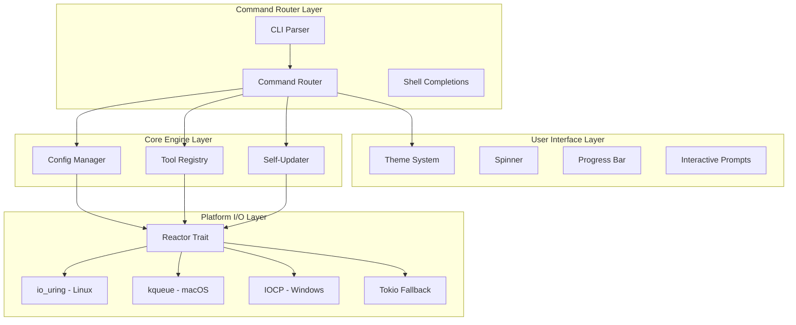

# Design Document: DX CLI

## Overview

The DX CLI is a binary-first, Vercel-inspired command-line interface built in Rust that orchestrates development tools with maximum performance. The architecture prioritizes platform-native async I/O, beautiful minimal output, and battle-tested error handling.

The design follows a layered architecture:
1. **User Interface Layer** - Theme, spinners, progress bars, interactive prompts
2. **Command Router Layer** - CLI parsing and command dispatch
3. **Core Engine Layer** - Config management, plugin system, task runner
4. **Platform I/O Abstraction** - Unified API over io_uring/kqueue/IOCP

## Architecture



## Components and Interfaces

### 1. Reactor Trait (Platform I/O Abstraction)

The Reactor trait provides a unified async I/O interface across platforms:

```rust
/// Unified reactor trait for platform-specific I/O
pub trait Reactor: Send + Sync + 'static {
    /// Read file contents asynchronously
    async fn read_file(&self, path: &Path) -> io::Result<Vec<u8>>;
    
    /// Write file contents asynchronously
    async fn write_file(&self, path: &Path, data: &[u8]) -> io::Result<()>;
    
    /// Spawn a process and capture output
    async fn spawn_process(&self, cmd: &str, args: &[&str]) -> io::Result<ProcessOutput>;
    
    /// Watch directory for changes
    async fn watch_dir(&self, path: &Path) -> io::Result<WatchStream>;
    
    /// HTTP GET request
    async fn http_get(&self, url: &str) -> io::Result<Response>;
    
    /// HTTP POST request with body
    async fn http_post(&self, url: &str, body: &[u8]) -> io::Result<Response>;
}

/// Factory function to create platform-optimal reactor
pub fn create_reactor() -> Box<dyn Reactor> {
    #[cfg(target_os = "linux")]
    { Box::new(IoUringReactor::new()) }
    
    #[cfg(target_os = "macos")]
    { Box::new(KqueueReactor::new()) }
    
    #[cfg(target_os = "windows")]
    { Box::new(IocpReactor::new()) }
    
    #[cfg(not(any(target_os = "linux", target_os = "macos", target_os = "windows")))]
    { Box::new(TokioReactor::new()) }
}
```

### 2. Theme System

```rust
pub struct Theme {
    pub primary: Style,    // cyan, bold
    pub success: Style,    // green
    pub warning: Style,    // yellow
    pub error: Style,      // red, bold
    pub muted: Style,      // dimmed
    pub accent: Style,     // magenta
    pub colors_enabled: bool,
}

impl Theme {
    pub fn new(color_mode: ColorMode) -> Self;
    pub fn print_logo(&self);
    pub fn success(&self, message: &str);
    pub fn error(&self, message: &str);
    pub fn info(&self, message: &str);
    pub fn warn(&self, message: &str);
    pub fn step(&self, current: usize, total: usize, message: &str);
    pub fn hint(&self, message: &str);
    pub fn suggest_command(&self, cmd: &str);
}

pub enum ColorMode {
    Always,
    Never,
    Auto,
}
```

### 3. Spinner Component

```rust
pub struct Spinner {
    pb: ProgressBar,
    message: String,
}

impl Spinner {
    pub fn new(message: impl Into<String>) -> Self;
    pub fn set_message(&self, message: impl Into<String>);
    pub fn finish_success(&self, message: impl Into<String>);
    pub fn finish_error(&self, message: impl Into<String>);
    pub fn finish_warn(&self, message: impl Into<String>);
}
```

### 4. Progress Bar Component

```rust
pub struct Progress {
    pb: ProgressBar,
}

impl Progress {
    pub fn new(total: u64, message: impl Into<String>) -> Self;
    pub fn download(total: u64, filename: &str) -> Self;
    pub fn inc(&self, delta: u64);
    pub fn set(&self, pos: u64);
    pub fn finish(&self);
}

pub struct MultiProgressBar {
    mp: MultiProgress,
    bars: Vec<ProgressBar>,
}

impl MultiProgressBar {
    pub fn new() -> Self;
    pub fn add(&mut self, total: u64, message: impl Into<String>) -> usize;
    pub fn set(&self, index: usize, pos: u64);
}
```

### 5. CLI Parser

```rust
#[derive(Parser)]
#[command(name = "dx", about = "The Binary-First Development Experience")]
pub struct Cli {
    #[command(subcommand)]
    pub command: Option<Commands>,
    
    #[arg(long, global = true)]
    pub no_color: bool,
    
    #[arg(short, long, global = true)]
    pub verbose: bool,
    
    #[arg(short, long, global = true)]
    pub quiet: bool,
    
    #[arg(long, global = true)]
    pub config: Option<PathBuf>,
}

#[derive(Subcommand)]
pub enum Commands {
    // Project commands
    Init(InitArgs),
    Dev(DevArgs),
    Build(BuildArgs),
    Run(RunArgs),
    Test(TestArgs),
    Deploy(DeployArgs),
    
    // DX Tools (10 commands)
    Style(StyleArgs),
    Media(MediaArgs),
    Font(FontArgs),
    Icon(IconArgs),
    Forge(ForgeArgs),
    Serializer(SerializerArgs),
    Stack(StackArgs),
    Driven(DrivenArgs),
    Generator(GeneratorArgs),
    Workspace(WorkspaceArgs),
    
    // Shell & Self
    Shell(ShellArgs),
    #[command(name = "self")]
    SelfCmd(SelfArgs),
    
    // Utility
    Info(InfoArgs),
    Clean(CleanArgs),
    Completions(CompletionsArgs),
}
```

### 6. Update Checker

```rust
pub struct UpdateChecker {
    reactor: Box<dyn Reactor>,
}

impl UpdateChecker {
    pub fn new(reactor: Box<dyn Reactor>) -> Self;
    pub async fn check(&self) -> Result<Option<UpdateInfo>>;
}

pub struct UpdateInfo {
    pub current_version: Version,
    pub new_version: Version,
    pub download_url: String,
    pub download_size: u64,
    pub delta_url: Option<String>,
    pub release_notes: String,
}
```

### 7. Delta Patcher

```rust
pub struct DeltaPatcher {
    reactor: Box<dyn Reactor>,
}

impl DeltaPatcher {
    pub fn new(reactor: Box<dyn Reactor>) -> Self;
    pub async fn apply(
        &self,
        current_binary: &PathBuf,
        patch_url: &str,
        theme: &Theme,
    ) -> Result<PathBuf>;
}
```

### 8. Shell Integration

```rust
#[derive(Debug, Clone, Copy)]
pub enum ShellType {
    Bash,
    Zsh,
    Fish,
    PowerShell,
    Nushell,
}

impl ShellType {
    pub fn detect() -> Option<Self>;
    pub fn config_path(&self) -> PathBuf;
}

pub fn generate_integration(shell: ShellType) -> String;
pub async fn install_shell(shell: Option<String>, theme: &Theme) -> Result<()>;
```

### 9. Command History

```rust
#[derive(Serialize, Deserialize)]
pub struct CommandHistory {
    entries: Vec<HistoryEntry>,
    max_entries: usize,
}

#[derive(Serialize, Deserialize)]
pub struct HistoryEntry {
    pub command: String,
    pub args: Vec<String>,
    pub exit_code: i32,
    pub duration_ms: u64,
    pub timestamp: u64,
    pub cwd: String,
}

impl CommandHistory {
    pub fn new(max_entries: usize) -> Self;
    pub fn load() -> Result<Self>;
    pub fn save(&self) -> Result<()>;
    pub fn add(&mut self, entry: HistoryEntry);
    pub fn recent(&self, count: usize) -> impl Iterator<Item = &HistoryEntry>;
    pub fn search(&self, query: &str) -> impl Iterator<Item = &HistoryEntry>;
    pub fn stats(&self) -> HistoryStats;
}
```

### 10. Error Types

```rust
#[derive(Error, Debug)]
pub enum DxError {
    #[error("Configuration file not found: {path}")]
    ConfigNotFound { path: PathBuf },
    
    #[error("Invalid configuration: {message}\n  → at {path}:{line}")]
    ConfigInvalid { path: PathBuf, line: usize, message: String },
    
    #[error("File not found: {path}")]
    FileNotFound { path: PathBuf },
    
    #[error("Permission denied: {path}")]
    PermissionDenied { path: PathBuf },
    
    #[error("Tool not installed: {name}\n  → Run `dx forge install {name}` to install")]
    ToolNotInstalled { name: String },
    
    #[error("Signature verification failed")]
    SignatureInvalid,
    
    // ... additional error variants
}

impl DxError {
    pub fn hint(&self) -> Option<&'static str>;
    pub fn is_retryable(&self) -> bool;
}
```

## Data Models

### Configuration (dx.toml)

```rust
#[derive(Serialize, Deserialize)]
pub struct DxConfig {
    pub name: String,
    pub version: Option<String>,
    pub description: Option<String>,
    
    #[serde(default)]
    pub build: BuildConfig,
    
    #[serde(default)]
    pub dev: DevConfig,
    
    #[serde(default)]
    pub tools: ToolsConfig,
}

#[derive(Serialize, Deserialize, Default)]
pub struct BuildConfig {
    pub output: PathBuf,
    pub target: Option<String>,
    pub minify: bool,
    pub sourcemap: bool,
}

#[derive(Serialize, Deserialize, Default)]
pub struct DevConfig {
    pub port: u16,
    pub host: String,
    pub open: bool,
    pub https: bool,
}

#[derive(Serialize, Deserialize, Default)]
pub struct ToolsConfig {
    pub style: Option<StyleToolConfig>,
    pub media: Option<MediaToolConfig>,
    // ... other tool configs
}
```

### Process Output

```rust
pub struct ProcessOutput {
    pub status: ExitStatus,
    pub stdout: Vec<u8>,
    pub stderr: Vec<u8>,
}
```

### HTTP Response

```rust
pub struct Response {
    pub status: u16,
    pub headers: HashMap<String, String>,
    pub body: Vec<u8>,
}
```

### History Statistics

```rust
pub struct HistoryStats {
    pub total: usize,
    pub successful: usize,
    pub failed: usize,
    pub avg_duration_ms: u64,
    pub top_commands: Vec<(String, usize)>,
}
```


## Correctness Properties

*A property is a characteristic or behavior that should hold true across all valid executions of a system—essentially, a formal statement about what the system should do. Properties serve as the bridge between human-readable specifications and machine-verifiable correctness guarantees.*

### Property 1: File I/O Round-Trip

*For any* byte sequence written to a file via the Reactor, reading that file should return the exact same byte sequence.

**Validates: Requirements 1.6**

### Property 2: Message Prefix Formatting

*For any* message displayed through Theme methods (success, error, info, warn) or Spinner finish methods (finish_success, finish_error, finish_warn), the output should contain the appropriate prefix symbol (✓, ✗, →, ⚠).

**Validates: Requirements 2.4, 2.5, 2.6, 2.7, 3.2, 3.3, 3.5**

### Property 3: Color-Disabled Output Purity

*For any* Theme with colors_enabled set to false, all output methods should produce strings containing no ANSI escape sequences.

**Validates: Requirements 2.2**

### Property 4: Step Indicator Format

*For any* step display with current and total values, the output should match the pattern "[{current}/{total}] {message}".

**Validates: Requirements 2.8**

### Property 5: Multi-Progress Bar Addition

*For any* sequence of progress bar additions to a MultiProgressBar, the number of bars should equal the number of add() calls.

**Validates: Requirements 4.3**

### Property 6: Update Version Display

*For any* UpdateInfo where new_version > current_version, the update display should contain both version strings.

**Validates: Requirements 6.2**

### Property 7: Delta Patch Preference

*For any* UpdateInfo where delta_url is Some, the update process should attempt to use the delta URL before falling back to download_url.

**Validates: Requirements 6.3**

### Property 8: Signature Verification Failure

*For any* patch or binary with an invalid Ed25519 signature, the update process should return a SignatureInvalid error and not apply the update.

**Validates: Requirements 6.5**

### Property 9: Delta Patch Application

*For any* valid old binary and valid bsdiff patch, applying the patch should produce a binary that matches the expected hash.

**Validates: Requirements 7.1**

### Property 10: Shell Integration Script Content

*For any* ShellType, the generated integration script should contain alias definitions for d, dr, db, dd, dt, dg, ds, df and a cd hook that detects dx.toml.

**Validates: Requirements 8.2, 8.3**

### Property 11: Shell Integration Duplicate Detection

*For any* shell config file that already contains "DX CLI Integration", the install_shell function should return without modifying the file.

**Validates: Requirements 8.5**

### Property 12: Shell Config Path Mapping

*For any* ShellType, config_path() should return the correct configuration file path for that shell.

**Validates: Requirements 8.6**

### Property 13: History Serialization Round-Trip

*For any* CommandHistory, serializing to bincode and deserializing should produce an equivalent CommandHistory.

**Validates: Requirements 9.1**

### Property 14: History Max Entries Enforcement

*For any* CommandHistory with max_entries = N, after adding M entries where M > N, the history should contain exactly N entries (the most recent ones).

**Validates: Requirements 9.3**

### Property 15: History Search Functionality

*For any* CommandHistory and search query, all returned entries should contain the query string in either the command or arguments.

**Validates: Requirements 9.4**

### Property 16: History Statistics Accuracy

*For any* CommandHistory, the stats() method should return accurate counts: total equals entries.len(), successful + failed equals total, and top_commands should be sorted by frequency descending.

**Validates: Requirements 9.5**

### Property 17: Error Retryability Classification

*For any* DxError of type Network, Timeout, or Tls, is_retryable() should return true. For all other error types, is_retryable() should return false.

**Validates: Requirements 10.3**

### Property 18: Path Separator Handling

*For any* path string with mixed separators (/ and \), resolve_path should produce a valid PathBuf that can be used for file operations.

**Validates: Requirements 11.1**

### Property 19: Home Directory Expansion

*For any* path string starting with "~/", resolve_path should replace the prefix with the user's home directory.

**Validates: Requirements 11.2**

### Property 20: Symlink Resolution Depth

*For any* path with N levels of symlinks where N <= 40, resolve_symlinks should successfully resolve to the final target. For N > 40, it should return an error.

**Validates: Requirements 11.4**

### Property 21: CI/Container Detection

*For any* environment where CI, GITHUB_ACTIONS, GITLAB_CI, TRAVIS, or CIRCLECI is set, is_ci() should return true. For environments with /.dockerenv or docker/kubepods in /proc/1/cgroup, is_container() should return true.

**Validates: Requirements 11.7**

### Property 22: Custom Config Path Override

*For any* CLI invocation with --config flag, the specified path should be used instead of the default dx.toml location.

**Validates: Requirements 12.2**

### Property 23: Invalid Config Error Reporting

*For any* invalid TOML configuration, the error should include the file path, line number, and descriptive message.

**Validates: Requirements 12.3**

### Property 24: Config Cache Round-Trip

*For any* DxConfig, caching to binary format and loading from cache should produce an equivalent DxConfig.

**Validates: Requirements 12.4**

## Error Handling

### Error Categories

1. **Configuration Errors**: Missing or invalid dx.toml, missing required fields
2. **I/O Errors**: File not found, permission denied, directory not found
3. **Network Errors**: Connection failures, timeouts, TLS errors
4. **Tool Errors**: Tool not installed, version mismatch, execution failure
5. **Build Errors**: Compilation failures with source location
6. **Update Errors**: Download failures, signature verification, checksum mismatch

### Error Recovery Strategies

| Error Type | Recovery Strategy |
|------------|-------------------|
| ConfigNotFound | Suggest `dx init` |
| PermissionDenied | Suggest elevated permissions |
| Network errors | Mark as retryable, suggest retry |
| ToolNotInstalled | Suggest `dx forge install` |
| SignatureInvalid | Abort, suggest re-download |
| Timeout | Retry with backoff |

### Graceful Degradation

- If io_uring unavailable on Linux, fall back to Tokio
- If colors not supported, output plain text
- If delta patch fails, download full binary
- If shell detection fails, prompt user for shell type

## Testing Strategy

### Unit Tests

Unit tests verify specific examples and edge cases:

- Theme color output with colors enabled/disabled
- Spinner state transitions
- Progress bar percentage calculations
- CLI argument parsing for all commands
- Error hint generation
- Path resolution edge cases (empty, relative, absolute, with ~)
- Shell type detection from environment
- History entry serialization

### Property-Based Tests

Property-based tests verify universal properties using the `proptest` crate with minimum 100 iterations per test.

Each property test must be tagged with:
```rust
// Feature: dx-cli, Property N: {property_text}
// Validates: Requirements X.Y
```

**Test Configuration:**
- Framework: `proptest` (Rust)
- Minimum iterations: 100
- Shrinking: enabled for counterexample minimization

**Key Property Tests:**

1. **File I/O Round-Trip** (Property 1)
   - Generate random byte vectors
   - Write to temp file, read back
   - Assert equality

2. **History Serialization Round-Trip** (Property 13)
   - Generate random CommandHistory
   - Serialize with bincode, deserialize
   - Assert structural equality

3. **Config Cache Round-Trip** (Property 24)
   - Generate random DxConfig
   - Cache to binary, load from cache
   - Assert equality

4. **History Max Entries** (Property 14)
   - Generate history with random max_entries
   - Add more entries than max
   - Assert len() == max_entries

5. **Path Handling** (Properties 18, 19)
   - Generate paths with various separators
   - Generate paths with ~ prefix
   - Assert valid resolution

### Integration Tests

- CLI binary execution with various arguments
- Shell completion generation
- Update checker with mock HTTP responses
- Full update flow with test binaries

### Platform-Specific Tests

- Linux: io_uring availability and basic operations
- macOS: kqueue availability
- Windows: IOCP availability, long path handling
