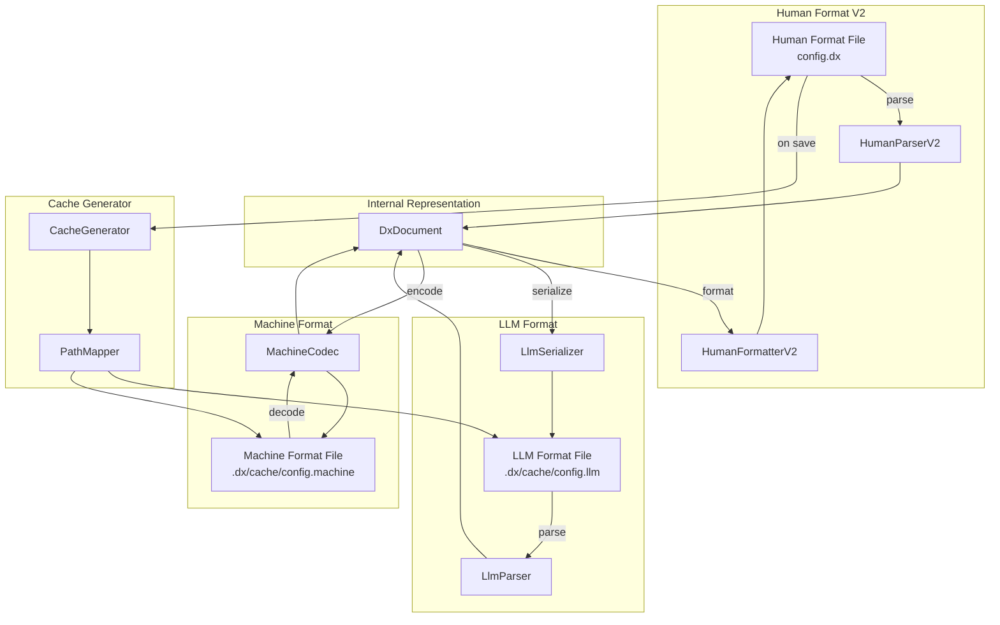

# Design Document: DX Serializer Human Format V2

## Overview

This design document describes the enhanced DX Serializer Human Format V2, which provides a cleaner, more readable configuration format with automatic synchronization to LLM and Machine formats. The system follows a "hub and spoke" architecture where all formats convert through a common internal representation (`DxDocument`), ensuring consistent round-trip behavior.

The key improvements include:
- Fixed sigil parsing to properly handle comment lines
- Full key name expansion (no more cryptic abbreviations)
- Flat TOML-like structure without YAML indentation
- Intelligent column wrapping for wide tables
- Automatic cache generation with path preservation

## Architecture



## Components and Interfaces

### 1. HumanParserV2

Enhanced parser that correctly handles all comment styles and supports both abbreviated and full key names.

```rust
pub struct HumanParserV2 {
    abbrev: AbbrevDict,
    config: ParserConfig,
}

pub struct ParserConfig {
    /// Accept abbreviated keys (for backward compatibility)
    pub accept_abbreviated: bool,
    /// Strict mode: fail on unknown keys
    pub strict_mode: bool,
}

impl HumanParserV2 {
    /// Parse human format string into DxDocument
    pub fn parse(&self, input: &str) -> Result<DxDocument, HumanParseError>;
    
    /// Check if a line is a comment (starts with '# ' or decorative)
    fn is_comment_line(&self, line: &str) -> bool;
    
    /// Parse a section header [section_name]
    fn parse_section_header(&self, line: &str) -> Option<String>;
    
    /// Parse key = value pair with full key name support
    fn parse_key_value(&self, line: &str) -> Result<Option<(String, DxLlmValue)>, HumanParseError>;
}
```

### 2. HumanFormatterV2

Enhanced formatter that produces flat TOML-like output with full key names and intelligent table wrapping.

```rust
pub struct HumanFormatterV2 {
    config: FormatterConfig,
    abbrev: AbbrevDict,
}

pub struct FormatterConfig {
    /// Maximum line width before wrapping
    pub max_line_width: usize,
    /// Table style (Unicode, ASCII, Markdown)
    pub table_style: TableStyle,
    /// Show section headers with decorative borders
    pub show_decorative_headers: bool,
    /// Expand abbreviated keys to full names
    pub expand_keys: bool,
}

impl HumanFormatterV2 {
    /// Format DxDocument to human-readable string
    pub fn format(&self, doc: &DxDocument) -> String;
    
    /// Format config section with aligned key = value pairs
    fn format_config_section(&self, context: &HashMap<String, DxLlmValue>) -> String;
    
    /// Format data section with Unicode table
    fn format_data_section(&self, id: char, section: &DxSection) -> String;
    
    /// Build table with column wrapping for wide content
    fn build_wrapped_table(&self, section: &DxSection, max_width: usize) -> String;
    
    /// Format array as comma-separated list without brackets
    fn format_array_flat(&self, items: &[DxLlmValue]) -> String;
}
```

### 3. AbbrevDictV2

Extended abbreviation dictionary with additional mappings for common configuration keys.

```rust
impl AbbrevDictV2 {
    /// Create dictionary with all standard mappings including new ones
    pub fn new() -> Self;
    
    /// Additional mappings for v2:
    /// - "v" -> "version"
    /// - "ws" -> "workspace" (singular, not workspaces)
    /// - "ed" -> "editors"
    /// - "repo" -> "repository"
    /// - "cont" -> "container"
    /// - "ci" -> "ci_cd"
}
```

### 4. CacheGenerator

Handles automatic generation of LLM and Machine format files when Human format changes.

```rust
pub struct CacheGenerator {
    config: CacheConfig,
}

pub struct CacheConfig {
    /// Root directory for cache files
    pub cache_root: PathBuf,
    /// Generate LLM format
    pub generate_llm: bool,
    /// Generate Machine format
    pub generate_machine: bool,
}

impl CacheGenerator {
    /// Generate cache files for a source file
    pub fn generate(&self, source_path: &Path, doc: &DxDocument) -> Result<CacheResult, CacheError>;
    
    /// Get cache path for a source file
    pub fn get_cache_path(&self, source_path: &Path, format: CacheFormat) -> PathBuf;
    
    /// Preserve subfolder structure in cache
    fn map_path_to_cache(&self, source_path: &Path) -> PathBuf;
}

pub enum CacheFormat {
    Llm,
    Machine,
}

pub struct CacheResult {
    pub llm_path: Option<PathBuf>,
    pub machine_path: Option<PathBuf>,
}
```

### 5. TableWrapper

Handles intelligent wrapping of wide table columns.

```rust
pub struct TableWrapper {
    max_width: usize,
}

impl TableWrapper {
    /// Wrap a table row into multiple display lines if needed
    pub fn wrap_row(&self, row: &[String], col_widths: &[usize]) -> Vec<Vec<String>>;
    
    /// Calculate optimal column widths considering max width
    pub fn calculate_widths(&self, section: &DxSection) -> Vec<usize>;
    
    /// Determine if a table needs wrapping
    pub fn needs_wrapping(&self, total_width: usize) -> bool;
}
```

## Data Models

### DxDocument (Existing)

```rust
#[derive(Debug, Clone, PartialEq)]
pub struct DxDocument {
    /// Context/config key-value pairs
    pub context: HashMap<String, DxLlmValue>,
    /// Reference definitions
    pub refs: HashMap<String, String>,
    /// Data sections (keyed by single char ID)
    pub sections: HashMap<char, DxSection>,
}
```

### DxSection (Existing)

```rust
#[derive(Debug, Clone, PartialEq)]
pub struct DxSection {
    /// Column schema (abbreviated keys)
    pub schema: Vec<String>,
    /// Data rows
    pub rows: Vec<Vec<DxLlmValue>>,
}
```

### CachePath

```rust
#[derive(Debug, Clone)]
pub struct CachePath {
    /// Original source path
    pub source: PathBuf,
    /// Relative path from project root
    pub relative: PathBuf,
    /// LLM format cache path
    pub llm: PathBuf,
    /// Machine format cache path
    pub machine: PathBuf,
}
```


## Correctness Properties

*A property is a characteristic or behavior that should hold true across all valid executions of a system—essentially, a formal statement about what the system should do. Properties serve as the bridge between human-readable specifications and machine-verifiable correctness guarantees.*

### Property 1: Comment and Sigil Parsing

*For any* input string containing lines starting with '# ' (comment), '#c:' (context), '#:' (reference), or '#<letter>(' (data section), the Human_Parser SHALL correctly identify and handle each line type without errors.

**Validates: Requirements 1.1, 1.2, 1.3, 1.4**

### Property 2: Key Abbreviation Round-Trip

*For any* DxDocument with abbreviated keys, formatting to Human format (expanding keys) and then converting back to LLM format (compressing keys) SHALL produce a document with the same data values. Unknown keys SHALL pass through unchanged in both directions.

**Validates: Requirements 2.1, 2.3, 2.5**

### Property 3: Parser Key Name Flexibility

*For any* Human format document containing a mix of abbreviated and full key names, the Human_Parser SHALL successfully parse all key-value pairs and produce a valid DxDocument.

**Validates: Requirements 2.2**

### Property 4: Format Structure Validation

*For any* DxDocument, the Human_Formatter output SHALL have:
- Key-value pairs without leading indentation
- Aligned '=' signs within each section
- Array values as comma-separated lists without brackets
- Section headers in TOML-style brackets
- Table borders starting at column 0 (no indentation)
- Full section names in data section headers

**Validates: Requirements 3.1, 3.2, 3.3, 3.4, 3.5, 4.1, 4.2**

### Property 5: Parser Section Name Flexibility

*For any* Human format document containing data sections with either full names (e.g., '[forge]') or single-letter identifiers (e.g., '[f]'), the Human_Parser SHALL correctly parse all sections.

**Validates: Requirements 4.3**

### Property 6: Table Wrapping Round-Trip

*For any* DxSection with rows exceeding the configured maximum width, formatting with wrapping and then parsing SHALL produce a section with identical row data. Wrapped rows SHALL maintain column alignment and include continuation indicators.

**Validates: Requirements 5.1, 5.2, 5.3, 5.5**

### Property 7: Cache Generation with Path Preservation

*For any* source file path, the Cache_Generator SHALL:
- Create both LLM and Machine format files
- Preserve the subfolder structure from source to cache
- Use the same base filename with appropriate extensions
- Create parent directories as needed
- Normalize path separators for cross-platform compatibility

**Validates: Requirements 6.1, 6.2, 6.3, 6.4, 7.3, 7.4**

### Property 8: Cache Error Handling

*For any* cache generation operation that fails, existing cache files SHALL remain uncorrupted and the error SHALL be reported.

**Validates: Requirements 6.5**

### Property 9: Table Dynamic Sizing

*For any* DxSection, after adding, removing, or modifying rows:
- Column widths SHALL adjust to fit all content
- Table borders SHALL maintain proper alignment
- All Unicode box-drawing characters SHALL be valid
- Parsing the modified table SHALL extract all row data correctly

**Validates: Requirements 8.1, 8.2, 8.3, 8.4, 8.5**

### Property 10: Format Round-Trip Consistency

*For any* valid document:
- Human → LLM → Human conversion SHALL preserve all data values
- LLM → Human → LLM conversion SHALL preserve all data values
- Any format → Machine → original format conversion SHALL preserve all data values
- Section and key ordering SHALL be preserved

**Validates: Requirements 9.1, 9.2, 9.3, 9.4, 9.5**

### Property 11: Pretty Printer Round-Trip

*For any* valid DxDocument, formatting with the Pretty_Printer and then parsing with the Human_Parser SHALL produce an equivalent document.

**Validates: Requirements 10.1, 10.2, 10.3**

## Error Handling

### Parse Errors

| Error Type | Condition | Recovery |
|------------|-----------|----------|
| `InvalidSigil` | Line starts with '#' but doesn't match known sigils | Skip line as comment |
| `MalformedContext` | Context section has invalid key\|value format | Return error with line number |
| `MalformedReference` | Reference definition missing key or value | Return error with line number |
| `MalformedSectionHeader` | Section header missing parentheses or schema | Return error with line number |
| `SchemaMismatch` | Data row has wrong number of columns | Return error with row index |
| `InvalidTableFormat` | Table borders don't match expected pattern | Attempt recovery, warn user |

### Cache Errors

| Error Type | Condition | Recovery |
|------------|-----------|----------|
| `DirectoryCreationFailed` | Cannot create cache directory | Return error, don't modify existing files |
| `WritePermissionDenied` | Cannot write to cache location | Return error, don't modify existing files |
| `SerializationFailed` | Document cannot be serialized to target format | Return error, don't modify existing files |
| `PathNormalizationFailed` | Invalid path characters | Return error with path details |

### Error Recovery Strategy

1. **Graceful Degradation**: If cache generation fails, the source file remains valid and usable
2. **Atomic Writes**: Cache files are written to temporary locations first, then renamed
3. **Validation Before Write**: Output is validated before writing to prevent corruption
4. **Detailed Error Messages**: Errors include line numbers, column positions, and context

## Testing Strategy

### Property-Based Testing

We will use the `proptest` crate for property-based testing in Rust. Each property test will run a minimum of 100 iterations with randomly generated inputs.

#### Test Configuration

```rust
proptest! {
    #![proptest_config(ProptestConfig::with_cases(100))]
    
    // Property tests here
}
```

#### Generators

1. **DxDocument Generator**: Generates random valid documents with:
   - Random context key-value pairs
   - Random reference definitions
   - Random data sections with varying schemas and row counts

2. **Human Format String Generator**: Generates random valid Human format strings with:
   - Comment lines (decorative and regular)
   - Config sections with mixed key styles
   - Data sections with tables of varying widths

3. **Path Generator**: Generates random file paths with:
   - Various directory depths
   - Different path separators
   - Edge cases (root, deeply nested, special characters)

### Unit Tests

Unit tests will cover:
- Specific examples from requirements (e.g., 'v' → 'version' expansion)
- Edge cases (empty documents, single-row tables, maximum width tables)
- Error conditions (invalid sigils, malformed tables)
- Integration points between components

### Test File Organization

```
crates/serializer/src/llm/
├── human_parser_v2.rs
├── human_parser_v2_test.rs      # Unit tests
├── human_formatter_v2.rs
├── human_formatter_v2_test.rs   # Unit tests
├── cache_generator.rs
├── cache_generator_test.rs      # Unit tests
└── props/
    ├── parser_props.rs          # Property tests for parsing
    ├── formatter_props.rs       # Property tests for formatting
    ├── roundtrip_props.rs       # Property tests for round-trip
    └── cache_props.rs           # Property tests for cache generation
```

### Test Tags

Each property test will be tagged with the feature name and property number:

```rust
// Feature: dx-serializer-human-format-v2, Property 1: Comment and sigil parsing
#[test]
fn prop_comment_and_sigil_parsing() { ... }
```
